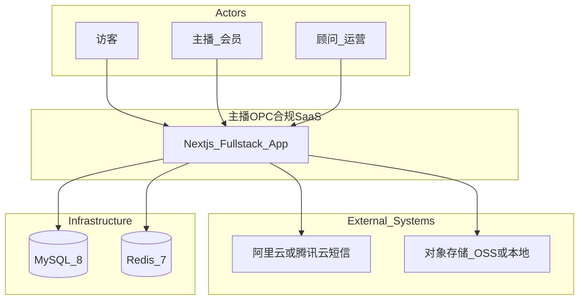
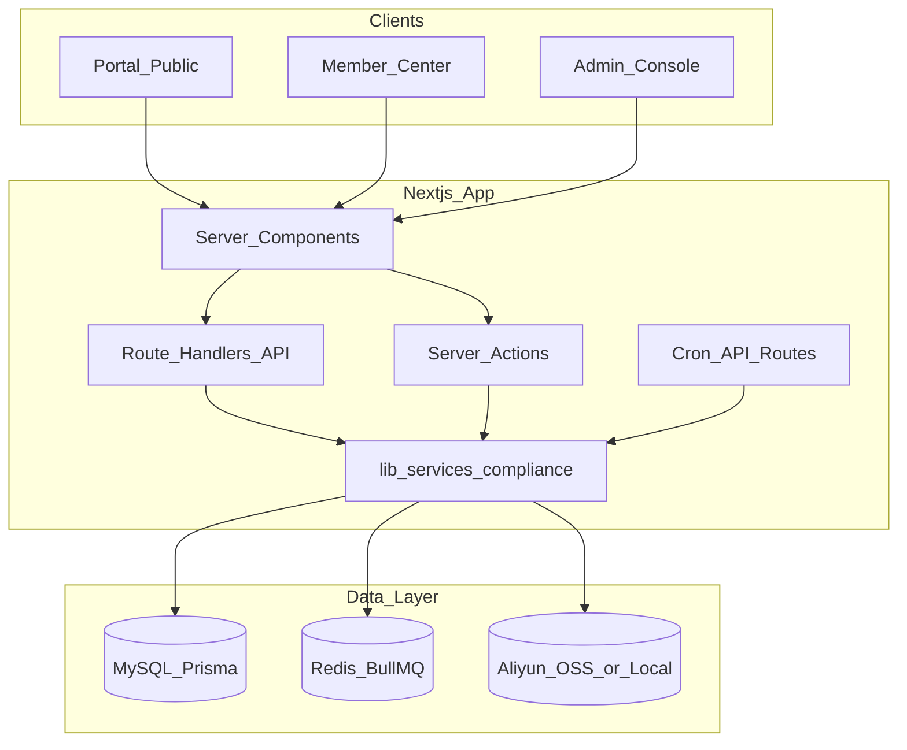
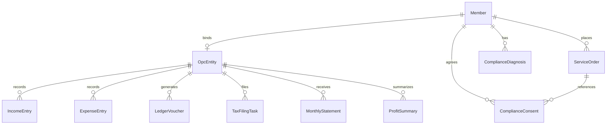

# 主播 OPC 合规服务 —— 技术选型与架构设计

> 版本：v1.0  
> 编制时间：2026年6月  
> 关联文档：[主播OPC合规服务-产品文档.md](../主播OPC合规服务-产品文档.md)、[MVP开发Backlog.md](../主播OPC合规服务-MVP开发Backlog.md)

---

## 一、文档目的

本文档定义 MVP（v0.1）的技术选型、系统架构、目录约定、API 契约与安全部署规范，供各模块 Agent 与后续迭代统一遵循。

**约束：**

- 仅使用 npm **公开官方/主流开源包**，禁止 `@yuanjing/*` 等私有包
- 数据库：**MySQL 8** + **Docker Compose**
- 登录：**手机号+密码** 与 **短信验证码** 并存
- MVP 范围：**32 项 P1** 功能（见 [Backlog §六](../主播OPC合规服务-MVP开发Backlog.md)）

---

## 二、系统上下文（C4 Level 1）



| 角色 | 入口 | 鉴权 |
|------|------|------|
| 访客 | `/`、`/diagnosis`、`/pricing` | 无 |
| 主播 | `/user/*` | Bearer Access Token + Refresh |
| 顾问 | `/admin/*` | Admin Session Cookie |

---

## 三、逻辑架构



### 3.1 分层职责

| 层 | 路径 | 职责 |
|----|------|------|
| 表现层 | `app/(portal)`、`app/(member)`、`app/(admin)` | 页面、布局、Client 交互 |
| API 层 | `app/api/**/route.ts` | HTTP 入口、鉴权、参数校验、信封包装 |
| 领域层 | `lib/services/compliance/**` | 业务规则、事务、审计 |
| 基础设施 | `lib/auth`、`lib/crypto`、`lib/storage`、`lib/queue` | 横切能力 |
| 数据层 | `prisma/schema.prisma` | 持久化、Migration |

### 3.2 核心闭环数据流

```
诊断(ComplianceDiagnosis) → 订单(ServiceOrder) → 合规留痕(ComplianceConsent)
→ OPC设立(OpcEntity) → 收支(IncomeEntry/ExpenseEntry) → 分录(LedgerVoucher)
→ 利润(ProfitSummary) → 申报(TaxFilingTask) → 对账单(MonthlyStatement)
```

---

## 四、技术选型

### 4.1 公开包选型表

| 能力 | 选型 | 版本约束 | 说明 |
|------|------|---------|------|
| 框架 | `next` | 15.x | App Router，默认 Server Component |
| 语言 | TypeScript | 5.x | strict 模式 |
| ORM | `prisma` + `@prisma/client` | 6.x | MySQL，snake_case `@map` |
| 会员认证 | `next-auth` (Auth.js v5) | 5.x | Credentials + OTP Provider |
| JWT | `jose` | 5.x | Access/Refresh Token 签发 |
| 密码 | `bcryptjs` | 2.x | 密码哈希 |
| 短信 | `@alicloud/dysmsapi20170525` | latest | 生产；开发 Mock |
| 校验 | `zod` | 3.x | API + 表单共用 Schema |
| UI | `tailwindcss` + shadcn/ui | 3.x / latest | 移动优先 |
| 数据获取 | `@tanstack/react-query` | 5.x | 客户端列表/表单提交 |
| 表单 | `react-hook-form` + `@hookform/resolvers` | latest | |
| UI 状态 | `zustand` | 4.x | 向导步骤、侧栏 |
| 日志 | `pino` + `pino-pretty` | latest | 结构化，敏感字段脱敏 |
| 加密 | Node `crypto` | 内置 | AES-256-GCM 字段级加密 |
| 队列 | `bullmq` + `ioredis` | latest | 催收、对账单异步任务 |
| CSV | `papaparse` | 5.x | 流水导入 |
| PDF | `pdfkit` | latest | 方案摘要、对账单、签约存档 |
| 文件存储 | `ali-oss` / 本地 FS | latest | 环境变量切换 |
| Markdown | `react-markdown` + `remark-gfm` | latest | 法律页，禁止 raw HTML |
| 测试 | `jest` + `@testing-library/react` | 29.x | 税负公式、合规规则 |
| 日期 | `date-fns` | 3.x | 申报日历 |
| 容器 | Docker Compose | — | mysql:8、redis:7、app |

### 4.2 与 yuanjing 内部包对照（本项目不使用）

| 内部包 | 替代方案 |
|--------|---------|
| `@yuanjing/passport-client` | 自建 `Member` + NextAuth Credentials |
| `@yuanjing/pino-logger` | `pino` |
| `@yuanjing/alicloud-oss` | `ali-oss` |
| `@yuanjing/fetch-api-client` | 自建 `lib/api/client.ts` + TanStack Query |
| `@yuanjing/result-struct` | 统一 API 信封 `{ code, message, data }` |

---

## 五、目录结构

```
tax/
├── app/
│   ├── (portal)/                    # 公开区
│   │   ├── page.tsx                 # P-01 首页
│   │   ├── diagnosis/
│   │   ├── pricing/
│   │   └── legal/
│   ├── (member)/user/               # 会员中心
│   │   ├── layout.tsx
│   │   ├── overview/
│   │   ├── login/ register/
│   │   └── compliance/              # 合规子模块页面
│   ├── (admin)/admin/               # 管理后台
│   │   └── compliance/
│   └── api/
│       ├── auth/[...nextauth]/
│       ├── site/compliance/           # 匿名 API
│       ├── member/                    # 会员 API
│       │   ├── auth/
│       │   └── compliance/
│       ├── admin/                     # 管理 API
│       │   ├── auth/
│       │   └── compliance/
│       ├── upload/
│       └── cron/                      # CRON_SECRET 保护
├── components/
│   ├── ui/                            # shadcn
│   ├── portal/
│   ├── member/
│   └── admin/
├── lib/
│   ├── api/                           # envelope, errors, client
│   ├── auth/                          # member, admin, otp
│   ├── crypto/                        # encrypt, mask
│   ├── storage/                       # local, oss
│   ├── queue/                         # bullmq workers
│   └── services/compliance/           # 领域服务
│       ├── diagnosis/
│       ├── order/
│       ├── opc/
│       ├── ledger/
│       ├── tax/
│       ├── statement/
│       └── audit/
├── prisma/
│   ├── schema.prisma
│   ├── migrations/
│   └── seed.ts
├── docs/                              # 设计文档
├── docker-compose.yml
├── Dockerfile
└── .env.example
```

---

## 六、API 统一契约

### 6.1 响应信封

```typescript
interface ApiResponse<T> {
  code: number;      // 0 = 成功
  message: string;
  data: T | null;
}
```

### 6.2 错误码分段

| 区间 | 含义 |
|------|------|
| 0 | 成功 |
| 1000–1999 | 通用（参数、未授权、不存在） |
| 2000–2999 | 账号与认证 |
| 3000–3999 | 诊断与方案 |
| 4000–4999 | 签约与 OPC |
| 5000–5999 | 台账 |
| 6000–6999 | 记账与申报 |
| 7000–7999 | 报告与合规 |

### 6.3 鉴权头

| 场景 | Header |
|------|--------|
| 会员 API | `Authorization: Bearer <access_token>` |
| Token 刷新 | `POST /api/member/auth/refresh` + refresh token body |
| 管理 API | `Cookie: admin_session=...` 或 `Authorization: Bearer <admin_token>` |
| Cron | `Authorization: Bearer <CRON_SECRET>` |

### 6.4 API 路由总览

详见各模块文档；Backlog 附录 B 为权威路径清单。

| 前缀 | 鉴权 | 示例 |
|------|------|------|
| `/api/site/compliance/*` | 无 | 诊断、计算器、套餐 |
| `/api/member/compliance/*` | 会员 | 订单、台账、对账单 |
| `/api/admin/compliance/*` | 管理员 | OPC 任务、申报、审计导出 |
| `/api/cron/*` | CRON_SECRET | 催收、对账单生成 |

---

## 七、数据架构概要

完整 Prisma 模型见 [M0-工程基础.md](./modules/M0-工程基础.md)。

**核心实体关系：**



**约定：**

- 所有业务表含 `deleted`、`deleted_at` 软删除
- 数据库字段 snake_case，Prisma `@map`
- 敏感字段（身份证、银行账号）应用层 AES-256-GCM 加密存储
- `OpcEntity.member_id` 唯一约束（MVP 单主体）

---

## 八、安全设计

| 项 | 方案 |
|----|------|
| 密码 | bcrypt cost=12 |
| Token | Access 15min + Refresh 7d，jose HS256 |
| 敏感数据 | `ENCRYPTION_KEY` 环境变量，AES-256-GCM |
| 脱敏 | 身份证 `110***********1234`；银行卡 `****1234` |
| 审计 | `ComplianceAuditLog` 记录改账、签约、申报 |
| XSS | React 默认转义；Markdown 用 react-markdown |
| CSRF | API Token 鉴权；Admin Cookie SameSite=Strict |
| 上传 | 白名单 mime、大小限制 10MB、病毒扫描 P2 |
| 日志 | 禁止输出明文身份证、Token |

---

## 九、异步任务与定时

| 任务 | 触发 | 实现 |
|------|------|------|
| 材料催收 | 每月 1–5 日 | Cron → BullMQ Job → MemberNotice |
| 对账单生成 | 次月 16–20 日 | Cron → 生成 PDF + MonthlyStatement |
| 申报任务生成 | 每月 1 日 | Cron → TaxFilingTask 初始化 |
| 逾期标记 | 每日 | Cron → status=overdue |

**幂等：** Job 使用 `jobId = taskType:opcId:period` 防重复。

---

## 十、部署架构

### 10.1 本地开发

```bash
docker compose up -d mysql redis
cp .env.example .env
npm install
npx prisma migrate dev
npm run db:seed
npm run dev
```

### 10.2 Docker Compose 服务

| 服务 | 镜像 | 端口 |
|------|------|------|
| mysql | mysql:8 | 3306 |
| redis | redis:7-alpine | 6379 |
| app | 自建 Dockerfile | 3000 |

### 10.3 环境变量（`.env.example`）

| 变量 | 说明 |
|------|------|
| `DATABASE_URL` | MySQL 连接串 |
| `REDIS_URL` | Redis 连接串 |
| `NEXTAUTH_SECRET` | Auth.js 密钥 |
| `JWT_SECRET` | Access/Refresh 签发 |
| `ENCRYPTION_KEY` | 32 字节 hex，字段加密 |
| `CRON_SECRET` | Cron 路由 Bearer |
| `SMS_PROVIDER` | `mock` / `aliyun` |
| `STORAGE_PROVIDER` | `local` / `oss` |
| `OSS_*` | 阿里云 OSS 配置（可选） |

### 10.4 生产扩展

- 多实例无状态部署，Session/Queue 走 Redis
- 静态资源 CDN
- Migration 走 CI/CD `prisma migrate deploy`

---

## 11. MVP Out of Scope（架构层）

| 能力 | 说明 |
|------|------|
| 电子税务局 API | 顾问人工申报 + 系统记录 |
| 腾讯电子签/法大大 | MVP 勾选 + PDF 存档 |
| 在线支付 | 后台手动开通订单 |
| OCR 流水导入 | MVP 仅 CSV |
| 微信 OAuth | P2；MVP 手机号登录 |

---

## 十二、模块文档索引

| 文档 | 路径 |
|------|------|
| M0 工程基础 | [modules/M0-工程基础.md](./modules/M0-工程基础.md) |
| M1 E1 账号与合规基础 | [modules/M1-E1-账号与合规基础.md](./modules/M1-E1-账号与合规基础.md) |
| M2 E2 诊断与方案 | [modules/M2-E2-诊断与方案.md](./modules/M2-E2-诊断与方案.md) |
| M3 E3 签约与 OPC 落地 | [modules/M3-E3-签约与OPC落地.md](./modules/M3-E3-签约与OPC落地.md) |
| M4 E4 收入与成本台账 | [modules/M4-E4-收入与成本台账.md](./modules/M4-E4-收入与成本台账.md) |
| M5 E5 记账与申报 | [modules/M5-E5-记账与申报.md](./modules/M5-E5-记账与申报.md) |
| M6 E6 报告触达与合规 | [modules/M6-E6-报告触达与合规.md](./modules/M6-E6-报告触达与合规.md) |
| M7 管理后台 | [modules/M7-管理后台.md](./modules/M7-管理后台.md) |
| M8 门户与会员壳层 | [modules/M8-门户与会员壳层.md](./modules/M8-门户与会员壳层.md) |
| 多 Agent 编排 | [02-多Agent开发编排.md](./02-多Agent开发编排.md) |

---

*税率与政策以主管机关最新文件为准。*
