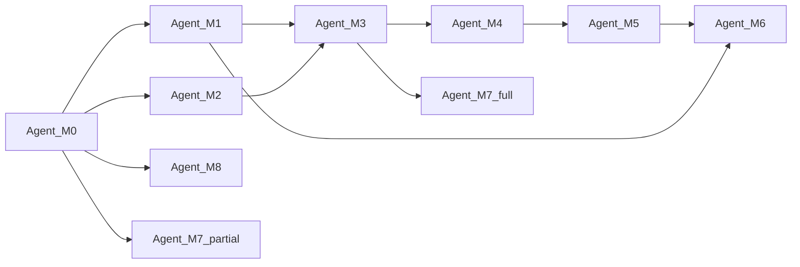

# 多 Agent 开发编排

> 版本：v1.0  
> 前置：全部 `docs/modules/M0~M8` 与 [01-技术选型与架构设计.md](./01-技术选型与架构设计.md) 已完成

---

## 一、Agent 分工

| Agent | 模块 | 必读文档 | 主要输出目录 |
|-------|------|---------|-------------|
| **M0** | 工程基础 | M0, 01-架构 | 根目录脚手架、`prisma/`, `lib/api/`, `lib/auth/` |
| **M1** | E1 账号 | M0, M1 | `app/api/member/auth/`, `app/(member)/user/login` |
| **M2** | E2 诊断 | M0, M2 | `app/(portal)/diagnosis/`, `lib/services/compliance/diagnosis/` |
| **M8** | 门户壳层 | M0, M8, M1 | `components/portal/`, `components/member/`, 首页 |
| **M3** | E3 签约OPC | M1, M2, M3 | `app/(member)/user/compliance/plan`, `opc/` |
| **M7** | 管理后台 | M0, M3, M5, M7 | `app/(admin)/admin/compliance/` |
| **M4** | E4 台账 | M3, M4 | `income/`, `expense/`, ledger services |
| **M5** | E5 记账申报 | M4, M5 | `ledger/`, `tax/` |
| **M6** | E6 报告合规 | M5, M6, M7 | `statement/`, `audit/`, cron |

---

## 二、依赖与执行顺序



1. **Wave 0**：M0（阻塞）
2. **Wave 1**（并行）：M1, M2, M8
3. **Wave 2**：M3
4. **Wave 3**（并行）：M4, M7
5. **Wave 4**：M5
6. **Wave 5**：M6
7. **Wave 6**：集成验收

---

## 三、分支策略

- 分支命名：`feature/m{N}-{简述}`
- 合并前检查：
  ```bash
  npm run lint
  npm run typecheck
  npx prisma migrate deploy
  npm test
  ```
- 合并顺序：M0 → M1/M2/M8 → M3 → M4/M7 → M5 → M6

---

## 四、每个 Agent 工作包 Checklist

- [ ] 阅读对应模块设计文档
- [ ] 实现 `lib/services/compliance/<domain>/`
- [ ] 实现 API Route Handlers（Backlog 附录 B）
- [ ] 实现页面/组件（信息架构 P-xx）
- [ ] 编写 Jest 单测（税则/合规规则）
- [ ] 更新模块文档「实现状态」表
- [ ] 不引入私有 npm 包

---

## 五、端到端验收（AC-01 ~ AC-08）

| # | 验收项 | 验证步骤 | 负责模块 |
|---|--------|---------|---------|
| AC-01 | 匿名诊断 | 访客完成 `/diagnosis` → 结果页四列对比 | M2 |
| AC-02 | 注册签约 | 注册→风险告知→签约→订单 active | M1, M3 |
| AC-03 | OPC 落地 | 提交资料→顾问更新→时间轴 | M3, M7 |
| AC-04 | 月度台账 | 录入收入费用→利润预览 | M4, M5 |
| AC-05 | 申报任务 | 日历任务→顾问标记 filed | M5, M7 |
| AC-06 | 对账单 | 次月生成→PDF→通知 | M6 |
| AC-07 | 合规留痕 | consent + audit 可查 | M1, M3, M6 |
| AC-08 | 敏感数据 | 加密存储+脱敏+鉴权 | M0, M1 |

验收记录写入 [03-验收记录.md](./03-验收记录.md)。

---

## 六、集成冒烟路径

```
/ → /diagnosis → /diagnosis/result
→ /user/register → /user/compliance/plan → /user/compliance/opc
→ (admin) opc-tasks 推进至 active
→ /user/compliance/income + expense → /user/compliance/ledger
→ /user/compliance/tax → (admin) filing 标记
→ /user/compliance/statement
```

---

*编排文档随 Sprint 更新。*
