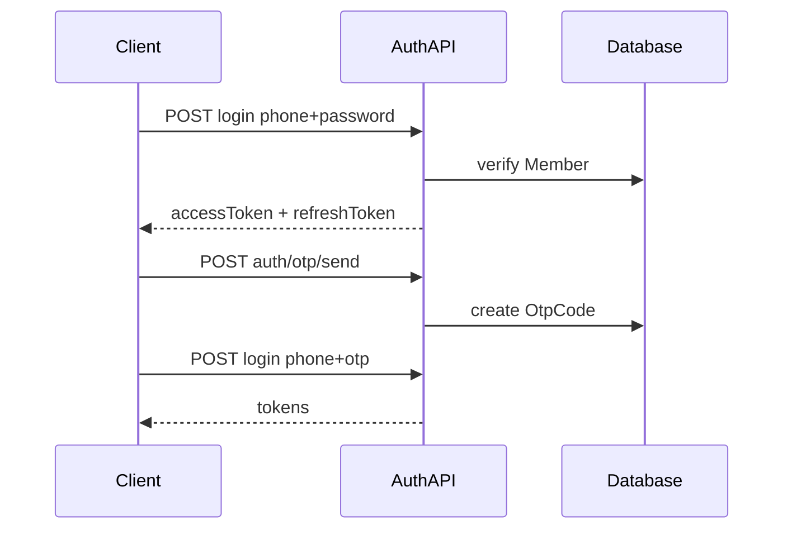

# M1 — E1 账号与合规基础模块设计

> 依赖：[M0-工程基础.md](./M0-工程基础.md)  
> Epic：E1 | User Stories：US-E1-01 ~ US-E1-08

---

## 一、模块职责

会员注册登录（密码+短信 OTP）、Token 刷新、隐私/用户协议、合规同意留痕、敏感数据加密与脱敏、OPC 主体绑定展示。

---

## 二、功能清单（§4.12 完整）

| 编号 | 功能点 | 描述 | 优先级 | MVP |
|------|--------|------|--------|-----|
| F-85 | 主播端注册登录 | 手机号/微信，实名认证 | **P1** | 是（不含微信） |
| F-86 | OPC 主体绑定 | 一个账号绑定一个 OPC | **P1** | 是 |
| F-87 | 消息中心 | 申报、催收、政策、系统通知 | **P2** | 简版 |
| F-88 | 帮助中心/FAQ | 实操手册 Q&A | **P3** | 否 |
| F-89 | 数据安全与加密 | 身份证、银行流水加密 | **P1** | 是 |
| F-90 | 隐私政策与用户协议 | 数据用途与共享边界 | **P1** | 是 |

---

## 三、P1 详细设计

### 3.1 User Story 映射

| ID | 功能 | 实现要点 |
|----|------|---------|
| US-E1-01 | 手机号注册登录 | `/api/member/auth/register`, `/login` |
| US-E1-02 | Token 刷新 | `/api/member/auth/refresh`，401 拦截 |
| US-E1-03 | OPC 绑定展示 | `/user/profile` + `/api/member/compliance/opc` |
| US-E1-04 | 单主体约束 | `OpcEntity.memberId` UNIQUE |
| US-E1-05 | 协议页面 | `/legal/privacy`, `/legal/terms` |
| US-E1-06 | 同意留痕 | `ComplianceConsent` type=terms/privacy |
| US-E1-07 | 敏感加密 | `lib/crypto` 应用于身份证等 |
| US-E1-08 | 后台脱敏 | Admin API 返回掩码 |

### 3.2 认证流程



### 3.3 API

| 方法 | 路径 | 说明 |
|------|------|------|
| POST | `/api/member/auth/register` | 注册，需勾选协议 |
| POST | `/api/member/auth/login` | 密码或 OTP 登录 |
| POST | `/api/member/auth/otp/send` | 发送验证码 |
| POST | `/api/member/auth/refresh` | 刷新 Token |
| GET | `/api/member/compliance/opc` | OPC 主体信息 |
| GET | `/api/member/profile` | 会员资料 |

### 3.4 ComplianceConsent（本模块）

```prisma
model ComplianceConsent {
  id              BigInt   @id @default(autoincrement())
  memberId        BigInt   @map("member_id")
  orderId         BigInt?  @map("order_id")
  type            String   // terms, privacy, risk_disclosure, plan_confirm, contract_sign
  documentVersion String   @map("document_version")
  ip              String?  @db.VarChar(45)
  userAgent       String?  @map("user_agent") @db.Text
  agreedAt        DateTime @map("agreed_at")
  @@map("compliance_consents")
}
```

### 3.5 页面

| 路径 | PRD |
|------|-----|
| `/user/login` | F-85 |
| `/user/register` | F-85, F-90 |
| `/user/profile` | F-86, F-89 |
| `/legal/privacy` | F-90 |
| `/legal/terms` | F-90 |

---

## 四、P2–P5 概要

- **F-87** 消息中心：复用 `MemberNotice`，`/user/notification` 列表 P2
- **F-88** FAQ：CMS `/docs` P3
- **F-85 微信登录**：OAuth Provider P2

---

## 五、验收标准

- AC-02 注册签约前置登录可用
- AC-08 敏感数据加密、接口鉴权

---

## 六、实现状态

| Story | 文件 | 状态 |
|-------|------|------|
| US-E1-01 | `app/api/member/auth/*` | 待实现 |
