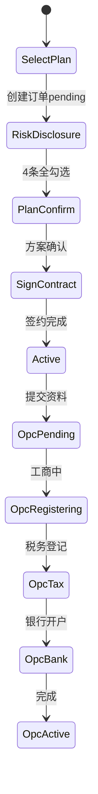

# M3 — E3 签约与 OPC 落地模块设计

> 依赖：[M0](./M0-工程基础.md)、[M1](./M1-E1-账号与合规基础.md)、[M2](./M2-E2-诊断与方案.md)  
> Epic：E3 | Stories：US-E3-01 ~ US-E3-12

---

## 一、模块职责

服务套餐、订单创建、风险告知、方案确认、电子签约、OPC 注册资料、工商/税务/银行进度跟踪。

---

## 二、功能清单

### §4.2 签约与订单

| 编号 | 功能点 | 描述 | 优先级 | MVP |
|------|--------|------|--------|-----|
| F-09 | 服务套餐配置 | 基础/进阶/尊享 | **P1** | 是 |
| F-10 | 电子签约 | 腾讯电子签/法大大 | **P1** | 简版 |
| F-11 | 方案书面确认 | 电子确认留痕 | **P1** | 是 |
| F-12 | 强制风险告知 | 4条底线声明 | **P1** | 是 |
| F-13 | 订单与 SLA 看板 | 时效承诺 | **P2** | 否 |
| F-14 | 在线支付/续费 | 自动扣款 | **P3** | 否 |
| F-15 | 发票开具（服务费） | 咨询费发票 | **P4** | 否 |

### §4.3 OPC 主体设立

| 编号 | 功能点 | 描述 | 优先级 | MVP |
|------|--------|------|--------|-----|
| F-16 | 注册资料收集 | 身份证等 | **P1** | 是 |
| F-17 | 工商注册代办 | 进度跟踪 | **P1** | 是 |
| F-18 | 税务登记 | 电子税务局激活 | **P1** | 是 |
| F-19 | 银行开户指引 | 材料清单 | **P1** | 是 |
| F-20 | 刻章与备案 | 公章等 | **P2** | 否 |
| F-21 | 经营范围智能推荐 | 合规表述 | **P2** | 否 |
| F-22 | 注册地址解决方案 | 挂靠/园区 | **P3** | 否 |
| F-23 | 个体户迁移至 OPC | 注销/并存 | **P3** | 否 |
| F-24 | MCN 主体切换协助 | 对公合同 | **P3** | 否 |
| F-25 | 多 OPC 架构 | 控股+业务 | **P5** | 否 |

---

## 三、P1 详细设计

### 3.1 签约状态机



### 3.2 数据模型

```prisma
model ServicePlan {
  id           BigInt  @id @default(autoincrement())
  name         String
  tier         String  // basic, advanced, premium
  monthlyPrice Decimal @map("monthly_price") @db.Decimal(10, 2)
  features     Json
  active       Boolean @default(true)
  @@map("service_plans")
}

model ServiceOrder {
  id             BigInt    @id @default(autoincrement())
  memberId       BigInt    @map("member_id")
  planId         BigInt    @map("plan_id")
  diagnosisId    BigInt?   @map("diagnosis_id")
  status         String    // pending, active, cancelled
  amount         Decimal   @db.Decimal(10, 2)
  signedAt       DateTime? @map("signed_at")
  contractFileId BigInt?   @map("contract_file_id")
  deleted        Boolean   @default(false)
  createdAt      DateTime  @default(now()) @map("created_at")
  @@map("service_orders")
}

model OpcEntity {
  id              BigInt   @id @default(autoincrement())
  memberId        BigInt   @unique @map("member_id")
  companyName     String?  @map("company_name")
  creditCode      String?  @map("credit_code")
  status          String   // pending, materials, registering, tax, bank, active
  businessScope   String?  @map("business_scope") @db.Text
  registerAddress String?  @map("register_address")
  idCardEncrypted String?  @map("id_card_encrypted") @db.Text
  phone           String?
  email           String?
  bankAccountEnc  String?  @map("bank_account_enc")
  licenseFileId   BigInt?  @map("license_file_id")
  deleted         Boolean  @default(false)
  createdAt       DateTime @default(now()) @map("created_at")
  updatedAt       DateTime @updatedAt @map("updated_at")
  @@map("opc_entities")
}

model OpcProgressLog {
  id        BigInt   @id @default(autoincrement())
  opcId     BigInt   @map("opc_id")
  step      String   // materials, business, tax, bank, complete
  status    String
  note      String?  @db.Text
  operatedBy BigInt? @map("operated_by")
  createdAt DateTime @default(now()) @map("created_at")
  @@map("opc_progress_logs")
}
```

### 3.3 风险告知（F-12）四条

1. 本服务为合规方案，非逃税方案
2. 不承诺「包不被查」
3. 不提供虚开发票、隐瞒收入服务
4. 税负取决于真实成本与收入

### 3.4 API

| 方法 | 路径 | Story |
|------|------|-------|
| GET | `/api/site/compliance/plans` | US-E3-01 |
| POST | `/api/member/compliance/order` | US-E3-02 |
| POST | `/api/member/compliance/consent` | US-E3-04,05 |
| POST | `/api/member/compliance/sign` | US-E3-06 |
| POST | `/api/member/compliance/opc/materials` | US-E3-08 |
| GET | `/api/member/compliance/opc/progress` | US-E3-12 |

### 3.5 页面

| 路径 | 原型 |
|------|------|
| `/pricing` | P-04 |
| `/user/compliance/plan` | P-05 |
| `/user/compliance/opc` | P-06 |

---

## 四、P2–P5 概要

- F-10 腾讯电子签 API 替换 MVP 姓名确认 P2
- F-13 SLA 倒计时组件 P2
- F-20 刻章节点加入时间轴 P2

---

## 五、验收标准

- AC-02 注册签约闭环
- AC-03 OPC 落地时间轴可见
- AC-07 方案确认、风险告知留痕

---

## 六、实现状态

| Story | 文件 | 状态 |
|-------|------|------|
| US-E3-06 | `lib/services/compliance/order/sign.ts` | 待实现 |
