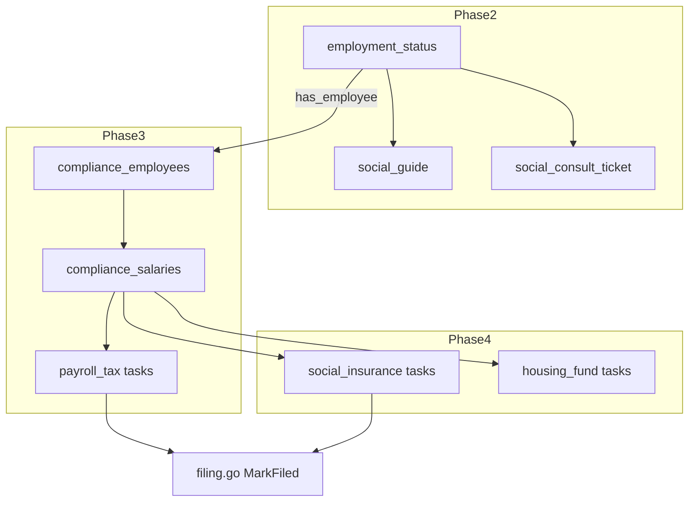

# M9 — 社保与用工合规 · 技术设计文档（TDD）

> 版本：v1.0  
> 编制时间：2026年6月  
> 关联 PRD：[M9-社保与用工合规-产品需求.md](./M9-社保与用工合规-产品需求.md)  
> 依赖：[M0 工程基础](./M0-工程基础.md)、[M5 记账与申报](./M5-E5-记账与申报.md)

---

## 一、设计原则

1. **与税务申报同构**：社保申报任务（Phase 4）复用 `tax_filing_tasks` 任务流与顾问标记逻辑，避免平行造轮子。
2. **分阶段落库**：Phase 2 仅新增 2 张表 + 扩展 `opc_entities`；Phase 3/4 再引入员工与申报扩展。
3. **条件逻辑前置**：用工状态 `employment_status` 作为清单跳过、任务生成的单一事实来源。
4. **敏感数据加密**：员工身份证号复用 `compliancecrypto` 包，与 OPC 资料一致。
5. **无外部 API 假设**：Phase 2–4 均为「顾问人工代办 + 系统记录」，与 MVP 税务申报策略一致。

---

## 二、系统架构

### 2.1 模块划分

```
server/internal/logic/compliance/
├── social/                    # 新增：社保咨询、指引（Phase 2）
│   ├── guide.go
│   ├── consult.go
│   └── employment.go          # 用工状态读写
├── payroll/                   # 新增：员工与工资（Phase 3）
│   ├── employee.go
│   └── salary.go
└── tax/
    ├── tax.go                 # 扩展：清单 N/A 逻辑
    ├── tasks.go               # 扩展：social_insurance 任务生成（Phase 4）
    └── filing.go              # 已有：顾问标记，无需改接口形态
```

### 2.2 依赖关系



---

## 三、数据模型

### 3.1 Phase 2：扩展 OPC 主体

```sql
-- migrate: 1.5.0_compliance_employment.mysql.sql
ALTER TABLE `opc_entities`
  ADD COLUMN `employment_status` VARCHAR(20) NOT NULL DEFAULT 'unknown'
    COMMENT 'no_employee|has_employee|unknown' AFTER `status`,
  ADD COLUMN `employment_confirmed_at` DATETIME NULL COMMENT '用工状态确认时间' AFTER `employment_status`;
```

### 3.2 Phase 2：社保咨询工单

```sql
CREATE TABLE `compliance_social_consults` (
  `id`            BIGINT UNSIGNED NOT NULL AUTO_INCREMENT,
  `member_id`     BIGINT UNSIGNED NOT NULL,
  `opc_id`        BIGINT UNSIGNED NOT NULL,
  `category`      VARCHAR(32)  NOT NULL DEFAULT 'founder'
    COMMENT 'founder=创始人参保|employee=雇员参保|other',
  `question`      TEXT         NOT NULL,
  `region_code`   VARCHAR(12)  NULL COMMENT '省市区编码，用于属地政策',
  `status`        VARCHAR(20)  NOT NULL DEFAULT 'open'
    COMMENT 'open|replied|closed',
  `reply`         TEXT         NULL,
  `replied_by`    BIGINT UNSIGNED NULL COMMENT '顾问 admin id',
  `replied_at`    DATETIME     NULL,
  `closed_at`     DATETIME     NULL,
  `deleted`       TINYINT(1)   NOT NULL DEFAULT 0,
  `created_at`    DATETIME     NOT NULL DEFAULT CURRENT_TIMESTAMP,
  `updated_at`    DATETIME     NOT NULL DEFAULT CURRENT_TIMESTAMP ON UPDATE CURRENT_TIMESTAMP,
  PRIMARY KEY (`id`),
  KEY `idx_member` (`member_id`),
  KEY `idx_opc_status` (`opc_id`, `status`)
) ENGINE=InnoDB DEFAULT CHARSET=utf8mb4 COMMENT='社保咨询工单';
```

### 3.3 Phase 2：社保指引内容（可配置）

```sql
CREATE TABLE `compliance_social_guide_articles` (
  `id`           BIGINT UNSIGNED NOT NULL AUTO_INCREMENT,
  `slug`         VARCHAR(64)  NOT NULL COMMENT '如 flexible_employment',
  `title`        VARCHAR(128) NOT NULL,
  `summary`      VARCHAR(512) NULL,
  `content_md`   MEDIUMTEXT   NOT NULL,
  `audience`     VARCHAR(32)  NOT NULL DEFAULT 'founder' COMMENT 'founder|employer',
  `sort`         INT          NOT NULL DEFAULT 0,
  `enabled`      TINYINT(1)   NOT NULL DEFAULT 1,
  `created_at`   DATETIME     NOT NULL DEFAULT CURRENT_TIMESTAMP,
  `updated_at`   DATETIME     NOT NULL DEFAULT CURRENT_TIMESTAMP ON UPDATE CURRENT_TIMESTAMP,
  PRIMARY KEY (`id`),
  UNIQUE KEY `uk_slug` (`slug`)
) ENGINE=InnoDB DEFAULT CHARSET=utf8mb4;
```

Seed 数据：`flexible_employment`、`founder_vs_employee`、`faq_q3`。

### 3.4 Phase 3：员工档案

```sql
CREATE TABLE `compliance_employees` (
  `id`              BIGINT UNSIGNED NOT NULL AUTO_INCREMENT,
  `opc_id`          BIGINT UNSIGNED NOT NULL,
  `name`            VARCHAR(64)  NOT NULL,
  `id_card_enc`     VARCHAR(512) NOT NULL COMMENT 'AES 加密',
  `id_card_mask`    VARCHAR(32)  NOT NULL COMMENT '脱敏展示',
  `mobile`          VARCHAR(20)  NULL,
  `hire_date`       DATE         NOT NULL,
  `leave_date`      DATE         NULL,
  `status`          VARCHAR(20)  NOT NULL DEFAULT 'active' COMMENT 'active|left',
  `contract_file_id` BIGINT UNSIGNED NULL,
  `deleted`         TINYINT(1)   NOT NULL DEFAULT 0,
  `created_at`      DATETIME     NOT NULL DEFAULT CURRENT_TIMESTAMP,
  `updated_at`      DATETIME     NOT NULL DEFAULT CURRENT_TIMESTAMP ON UPDATE CURRENT_TIMESTAMP,
  PRIMARY KEY (`id`),
  KEY `idx_opc_status` (`opc_id`, `status`)
) ENGINE=InnoDB DEFAULT CHARSET=utf8mb4;
```

### 3.5 Phase 3：月度工资

```sql
CREATE TABLE `compliance_salaries` (
  `id`            BIGINT UNSIGNED NOT NULL AUTO_INCREMENT,
  `opc_id`        BIGINT UNSIGNED NOT NULL,
  `employee_id`   BIGINT UNSIGNED NOT NULL,
  `period`        CHAR(7)      NOT NULL COMMENT 'YYYY-MM',
  `gross_amount`  DECIMAL(14,2) NOT NULL COMMENT '应发工资',
  `tax_amount`    DECIMAL(14,2) NOT NULL DEFAULT 0 COMMENT '代扣个税',
  `net_amount`    DECIMAL(14,2) NOT NULL COMMENT '实发',
  `social_base`   DECIMAL(14,2) NULL COMMENT '社保申报基数',
  `housing_base`  DECIMAL(14,2) NULL COMMENT '公积金申报基数',
  `status`        VARCHAR(20)  NOT NULL DEFAULT 'draft' COMMENT 'draft|confirmed',
  `voucher_id`    BIGINT UNSIGNED NULL COMMENT '关联 ledger_vouchers',
  `deleted`       TINYINT(1)   NOT NULL DEFAULT 0,
  `created_at`    DATETIME     NOT NULL DEFAULT CURRENT_TIMESTAMP,
  PRIMARY KEY (`id`),
  UNIQUE KEY `uk_emp_period` (`employee_id`, `period`),
  KEY `idx_opc_period` (`opc_id`, `period`)
) ENGINE=InnoDB DEFAULT CHARSET=utf8mb4;
```

### 3.6 Phase 4：申报任务扩展（复用现有表）

`tax_filing_tasks.tax_type` 扩展枚举：

| tax_type | 说明 | 生成条件 |
|----------|------|----------|
| `vat` | 已有 | 季度 |
| `cit_quarterly` | 已有 | 季末月 |
| `cit_annual` | 已有 | 年度 |
| `surcharge` | 已有 | 随 VAT |
| `payroll_tax` | 新增 Phase 3 | `has_employee` 且当月有 confirmed 工资 |
| `social_insurance` | 新增 Phase 4 | 同上 |
| `housing_fund` | 新增 Phase 4 | 同上 |

无需改表结构，仅扩展 `tax_type` 校验与任务生成 cron。

### 3.7 Phase 2：属地社保基数配置（可选，供 F-93 测算）

```sql
CREATE TABLE `compliance_social_region_rates` (
  `id`              BIGINT UNSIGNED NOT NULL AUTO_INCREMENT,
  `region_code`     VARCHAR(12)  NOT NULL,
  `year`            INT          NOT NULL,
  `pension_rate`    DECIMAL(6,4) NOT NULL COMMENT '个人养老比例',
  `medical_rate`    DECIMAL(6,4) NOT NULL,
  `unemployment_rate` DECIMAL(6,4) NOT NULL,
  `min_base`        DECIMAL(14,2) NOT NULL,
  `max_base`        DECIMAL(14,2) NOT NULL,
  `updated_at`      DATETIME     NOT NULL DEFAULT CURRENT_TIMESTAMP ON UPDATE CURRENT_TIMESTAMP,
  PRIMARY KEY (`id`),
  UNIQUE KEY `uk_region_year` (`region_code`, `year`)
) ENGINE=InnoDB DEFAULT CHARSET=utf8mb4;
```

---

## 四、API 设计

### 4.1 Phase 2 — 会员端

| 方法 | 路径 | 说明 |
|------|------|------|
| GET | `/api/member/compliance/opc/employment` | 获取用工状态 |
| PUT | `/api/member/compliance/opc/employment` | 设置 `no_employee` / `has_employee` |
| GET | `/api/member/compliance/social/guides` | 指引文章列表 |
| GET | `/api/member/compliance/social/guides/{slug}` | 指引详情 |
| POST | `/api/member/compliance/social/consults` | 提交咨询 |
| GET | `/api/member/compliance/social/consults` | 我的咨询列表 |
| GET | `/api/member/compliance/social/estimate` | 缴费测算（query: regionCode, base） |

**PUT employment 请求体：**

```json
{
  "employmentStatus": "no_employee"
}
```

**POST consult 请求体：**

```json
{
  "category": "founder",
  "question": "我在杭州注册了 OPC，本人如何缴纳医保？",
  "regionCode": "330100"
}
```

### 4.2 Phase 2 — 管理端

| 方法 | 路径 | 说明 |
|------|------|------|
| GET | `/api/admin/compliance/social/consults` | 咨询工单列表 |
| PATCH | `/api/admin/compliance/social/consults/{id}` | 回复/关闭 |

### 4.3 Phase 3 — 会员端

| 方法 | 路径 | 说明 |
|------|------|------|
| GET/POST | `/api/member/compliance/employees` | 员工 CRUD |
| GET/POST | `/api/member/compliance/salaries` | 月度工资录入 |
| POST | `/api/member/compliance/salaries/{id}/confirm` | 确认工资→触发分录 |

### 4.4 Phase 4 — 任务生成

复用现有：
- `GET /api/member/compliance/tax/calendar`
- `GET /api/admin/compliance/filing`
- `PATCH /api/admin/compliance/filing/{id}`

`tax_type` 筛选器前端增加 `payroll_tax`、`social_insurance`、`housing_fund`。

---

## 五、核心逻辑

### 5.1 自查清单 N/A 逻辑（改造 `tax.go`）

```go
// 伪代码
func enrichChecklist(items []ChecklistItem, employmentStatus string, hasActiveEmployees bool) []ChecklistItem {
    naKeys := map[string]bool{}
    if employmentStatus == "no_employee" || (!hasActiveEmployees && employmentStatus != "has_employee") {
        naKeys["payroll_tax"] = true
        naKeys["social_insurance"] = true
    }
    for i := range items {
        if naKeys[items[i].Key] {
            items[i].Checked = true
            items[i].Na = true
            items[i].Label = items[i].Label + "（不适用：无雇员）"
        }
    }
    return items
}
```

`ChecklistItem` 扩展字段：

```go
type ChecklistItem struct {
    Key     string `json:"key"`
    Label   string `json:"label"`
    Checked bool   `json:"checked"`
    Na      bool   `json:"na,omitempty"`
}
```

### 5.2 用工状态变更规则

| 从 | 到 | 允许 | 副作用 |
|----|-----|------|--------|
| unknown | no_employee | ✅ | 写 audit |
| unknown | has_employee | ✅ | 引导创建员工 |
| no_employee | has_employee | ✅ | 启用 B 类流程 |
| has_employee | no_employee | ⚠️ 需无 active 员工 | 否则拒绝 |

### 5.3 工资确认 → 自动分录（Phase 3）

| 事件 | 借方 | 贷方 |
|------|------|------|
| 确认工资 | 6402 职工薪酬 | 2241 应付职工薪酬 |
| 发放工资 | 2241 应付职工薪酬 | 1001 银行存款 |

新增科目 seed：`6402` 职工薪酬、`2241` 应付职工薪酬。

### 5.4 社保任务生成 Cron（Phase 4）

文件：`server/internal/crons/compliance_social_tasks.go`

```
每月 1 日 02:00：
  遍历 employment_status=has_employee 的 OPC
  若上月存在 status=confirmed 的 compliance_salaries
  生成 tax_filing_tasks:
    - payroll_tax, period=上月, dueDate=次月15日
    - social_insurance, period=上月, dueDate=按 region 配置
    - housing_fund, period=上月, dueDate=按 region 配置
  calculated_amount 初期为 0，顾问填报 filed_amount
```

与 `compliance_tax_tasks.go` 同构，可抽取 `shared/taskgen.go`。

### 5.5 社保缴费测算（Phase 2 可选）

```go
func EstimateSocialContribution(base float64, rates RegionRates) EstimateResult {
    base = clamp(base, rates.MinBase, rates.MaxBase)
    return EstimateResult{
        Pension:     round(base * rates.PensionRate),
        Medical:     round(base * rates.MedicalRate),
        Unemployment: round(base * rates.UnemploymentRate),
        Total:       ...,
    }
}
```

---

## 六、前端设计

### 6.1 目录结构

```
web/src/
├── api/
│   ├── frontend/compliance/social.ts      # Phase 2
│   └── backend/compliance/social.ts
├── views/
│   ├── frontend/compliance/
│   │   ├── social-guide.vue               # Phase 2
│   │   ├── social-consult.vue             # Phase 2
│   │   ├── employees.vue                  # Phase 3
│   │   └── tax.vue                        # 扩展 tax_type 展示
│   └── backend/compliance/
│       ├── social-consults/index.vue      # Phase 2
│       └── filing/index.vue               # 扩展筛选
```

### 6.2 OPC 落地页改造（`opc.vue`）

在 `status === 'active'` 后增加步骤卡片：

1. 单选：「目前是否有雇员？」（无 / 有）
2. 提交调用 `PUT /employment`
3. 无雇员 → 跳转或内嵌 `social-guide` 摘要
4. 有雇员 → 提示 Phase 3 将开放员工管理（或提前灰度）

### 6.3 申报页（`tax.vue`）改造

- `formatTaskTitle` 增加映射：
  - `payroll_tax` → 工资个税
  - `social_insurance` → 社会保险
  - `housing_fund` → 住房公积金
- 自查清单渲染：`item.na` 时灰色显示 + 禁用勾选

### 6.4 路由与菜单

`web/src/config/complianceMenu.ts` 增加：

```ts
{ path: '/user/compliance/social-guide', title: '社保指引', phase: 2 }
{ path: '/user/compliance/social-consult', title: '社保咨询', tier: 'advanced' }
```

---

## 七、权限与安全

| 资源 | 会员 | 顾问 | 管理员 |
|------|------|------|--------|
| 社保指引 | 读 | 读 | 写（内容） |
| 咨询工单 | 自己的 CRUD | 全部回复 | 全部 |
| 员工档案 | 自己的 OPC | 只读 | 全部 |
| 身份证 | 加密存储，接口脱敏 | 脱敏 | 可申请解密（审计） |

审计事件（`compliance_audit`）新增 action：
- `employment_status_change`
- `social_consult_create` / `social_consult_reply`
- `employee_create` / `salary_confirm`

---

## 八、与现有代码集成点

| 文件 | 改动 |
|------|------|
| `server/internal/logic/compliance/tax/tax.go` | `ChecklistItem` 增加 `Na`；`enrichChecklist` |
| `server/internal/logic/compliance/shared/opc.go` | 读取 `employment_status` |
| `server/internal/logic/compliance/tax/tasks.go` | Phase 4 任务类型 |
| `server/internal/controller/member/compliance.go` | 注册 social 路由 |
| `server/internal/controller/admin/compliance.go` | 注册 admin social 路由 |
| `web/src/api/frontend/compliance/member.ts` | 清单类型增加 `na?` |
| `web/src/views/frontend/compliance/tax.vue` | N/A 渲染 |

---

## 九、迁移与发布

### 9.1 迁移脚本顺序

1. `1.5.0_compliance_employment.mysql.sql` — Phase 2
2. `1.5.1_compliance_social_consult.mysql.sql` — Phase 2
3. `1.6.0_compliance_payroll.mysql.sql` — Phase 3

### 9.2 功能开关（`config.yaml`）

```yaml
compliance:
  social:
    guideEnabled: true          # Phase 2
    consultEnabled: true        # Phase 2
    payrollEnabled: false       # Phase 3
    filingTaskEnabled: false    # Phase 4
```

### 9.3 回滚策略

- Phase 2 表独立，关闭开关即可；`employment_status` 列可保留不影响旧逻辑。
- Phase 4 任务类型可通过 cron 开关停止生成，历史任务保留。

---

## 十、测试要点

### 10.1 单元测试

| 用例 | 包 |
|------|-----|
| `no_employee` 时清单 4/7 为 N/A | `tax` |
| `has_employee` 无员工档案时清单仍必填 | `tax` |
| 社保测算基数上下限钳制 | `social` |
| 工资确认生成分录金额正确 | `payroll` |

### 10.2 集成测试

- 会员提交咨询 → 顾问回复 → 会员可见
- 用工状态从 `no_employee` 改为 `has_employee` 后清单恢复必填
- Phase 4：确认工资后次月生成 3 类任务

---

## 十一、实现排期（估时）

| 任务 | 人天 | 阶段 |
|------|------|------|
| DB 迁移 + employment API | 1 | Phase 2 |
| 清单 N/A 逻辑 + 前后端 | 1.5 | Phase 2 |
| 社保指引 CMS + 页面 | 2 | Phase 2 |
| 咨询工单 前后端 | 2 | Phase 2 |
| 员工档案 + 工资录入 | 4 | Phase 3 |
| 工资分录 + payroll 任务 | 2 | Phase 3 |
| 社保/公积金任务 cron | 2 | Phase 4 |
| 属地费率配置 + 测算 | 2 | Phase 2/3 |

**Phase 2 合计约 6.5 人天。**

---

## 十二、开放问题

| # | 问题 | 建议 |
|---|------|------|
| 1 | 注册地 vs 经营地社保政策以何为准 | 默认 `opc_entities.register_address` 解析 `region_code` |
| 2 | 法人本人是否允许走公司参保 | 产品定为咨询工单人工答复，不做自动推荐 |
| 3 | 劳务外包人员是否进入员工表 | Phase 3 不做；仅劳动合同雇员 |
| 4 | 是否与第三方社保 SaaS 对接 | Phase 5 评估，如「51社保」「金保信」 |

---

## 附录：Input/Output 类型草案

```go
// compliancein/social.go
type EmploymentStatusInp struct {
    MemberId          uint64
    EmploymentStatus  string // no_employee | has_employee
}

type SocialConsultCreateInp struct {
    MemberId   uint64
    OpcId      uint64
    Category   string
    Question   string
    RegionCode string
}

type SocialGuideItem struct {
    Slug    string `json:"slug"`
    Title   string `json:"title"`
    Summary string `json:"summary"`
}

type SocialEstimateInp struct {
    RegionCode string
    Base       float64
}

type SocialEstimateModel struct {
    Base      float64 `json:"base"`
    Pension   float64 `json:"pension"`
    Medical   float64 `json:"medical"`
    Unemployment float64 `json:"unemployment"`
    Total     float64 `json:"total"`
    Note      string  `json:"note"`
}
```
