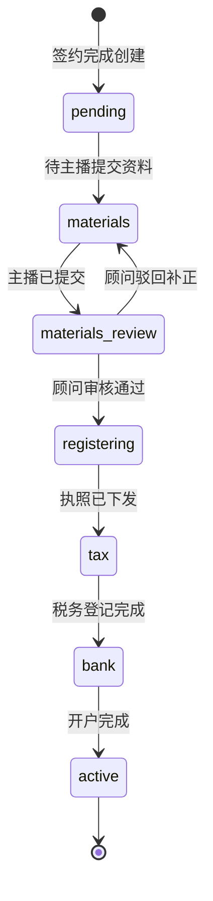

# 主播 OPC 合规服务 —— OPC 落地功能规格（详细版）

> 版本：v1.0  
> 编制时间：2026年6月  
> 依据：[主播OPC合规服务-MVP开发Backlog.md](主播OPC合规服务-MVP开发Backlog.md)（Epic E3 · F-16~F-19）、[主播OPC合规服务-产品文档.md](主播OPC合规服务-产品文档.md)、[主播OPC合规服务-信息架构与页面原型.md](主播OPC合规服务-信息架构与页面原型.md)  
> 范围：**一人有限责任公司（OPC）设立全流程** —— 资料收集、落库、顾问推进、主播进度可见

---

## 一、文档目的与成功标准

### 1.1 目的

将 Backlog 中 **OPC 落地**相关 User Story（US-E3-08 ~ US-E3-12、US-E1-03/04）展开为可开发、可验收的功能规格，确保：

1. 主播端收集的字段与附件，覆盖**真实工商电子化注册**常见材料要求；
2. 全部基本信息与附件关联**持久化落库**；
3. 顾问端可**查看脱敏后的客户资料**，并通过**分节点完成按钮**推进事务状态；
4. 主播端时间轴与顾问端状态**同源同步**。

### 1.2 验收标准（对应 Backlog AC-03、AC-08）

| 编号 | 标准 |
|------|------|
| OPC-AC-01 | 主播签约完成后可提交完整注册资料，必填项校验通过方可提交 |
| OPC-AC-02 | 身份证、银行卡号等敏感字段加密存储；顾问 API 仅返回脱敏值 |
| OPC-AC-03 | 顾问在任务详情页可查看：拟设公司信息、法人信息、地址与经营范围、附件清单 |
| OPC-AC-04 | 顾问按「资料审核 → 工商 → 税务 → 银行 → 完成」推进，每步有完成/驳回操作，写入进度日志与审计 |
| OPC-AC-05 | 主播 `/user/compliance/opc` 时间轴与 `OpcEntity.status` 一致，当前节点高亮 |
| OPC-AC-06 | 全部完成后 `status=active`，侧栏解锁收入/费用/申报菜单 |
| OPC-AC-07 | 关键操作（提交资料、顾问改状态）写入 `ComplianceAuditLog` |

---

## 二、业务背景：真实 OPC 设立需要什么

### 2.1 法律依据与产品约束（摘自 PRD §7.3）

| 要点 | 对产品的影响 |
|------|----------------|
| 一人股东 | 自然人独资；系统需记录法人=唯一股东，并提示「3 年内不得再设新 OPC」 |
| 认缴制注册资本 | 须采集注册资本金额与认缴期限（章程约定），禁止误导零责任 |
| 经营范围 | 须与实际直播/文化/信息技术业务匹配，提供推荐模板（P2 智能推荐） |
| 注册地址 | 须可联系；需地址证明材料（租赁/产权/园区挂靠协议） |
| 对公账户 | 执照+税务完成后开户；经营收支走对公户 |

### 2.2 工商电子化注册 —— 典型材料清单（MVP 须覆盖）

以下按**各地市场监管局「一网通办」**共性整理，MVP 以**结构化字段 + 附件上传**承载，顾问线下完成最终报送。

#### A. 公司设立登记（工商）

| 类别 | 材料/信息 | 产品采集方式 | 是否必填 |
|------|-----------|--------------|----------|
| 公司名称 | 拟用名称 1~3 个备选；名称自主申报 | 文本，最多 3 条 | 是 |
| 公司类型 | 有限责任公司（自然人独资） | 固定值，只读展示 | — |
| 注册资本 | 认缴金额（万元）、认缴期限（年） | 数字 + 下拉 | 是 |
| 经营范围 | 主营 + 一般项目表述 | 多行文本 + 推荐模板 | 是 |
| 注册地址 | 省市区 + 详细地址 | 级联选择 + 文本 | 是 |
| 地址证明 | 房屋租赁合同 / 产权证 / 园区地址证明 | 附件 PDF/图片 | 是 |
| 营业期限 | 长期 / 固定年限 | 单选 | 是 |
| 章程 | 系统生成标准章程（顾问确认） | MVP：顾问端勾选「章程已确认」 | 顾问确认 |

#### B. 股东/法人（自然人独资时同一人）

| 类别 | 材料/信息 | 产品采集方式 | 是否必填 |
|------|-----------|--------------|----------|
| 法人姓名 | 与身份证一致 | 文本 | 是 |
| 身份证号 | 18 位 | 文本，**加密落库** | 是 |
| 身份证有效期 | 起止日期 | 日期 | 是 |
| 身份证影像 | 正面、反面 | 附件各 1 | 是 |
| 民族 | 与证件一致 | 文本 | 是 |
| 户籍地址 | 证件住址 | 文本 | 是 |
| 现居住地址 | 经常居住地 | 文本 | 是 |
| 手机号 | 实名认证号 | 文本，与会员账号可校验一致 | 是 |
| 邮箱 | 接收执照、税务通知 | 文本 | 是 |
| 政治面貌 | 部分省份表单需要 | 下拉 | 视地区可选 |
| 电子签名授权 | 工商实名认证/电子签 | MVP：勾选授权 + 签约时已姓名确认 | 是 |

#### C. 设立结果（顾问录入，主播只读）

| 字段 | 说明 | 录入方 |
|------|------|--------|
| 核准公司名称 | 工商核准后的正式名称 | 顾问 |
| 统一社会信用代码 | 18 位 | 顾问 |
| 成立日期 | 执照签发日 | 顾问 |
| 营业执照 | 扫描件/PDF | 顾问上传，关联 `licenseFileId` |

#### D. 税务登记（执照后）

| 类别 | 说明 | 产品行为 |
|------|------|----------|
| 税务登记完成 | 已办税务登记、纳税人识别号就绪 | 顾问点击「税务登记完成」，填写电子税务局激活日期 |
| 纳税人类型 | 小规模纳税人（MVP 默认） | 系统默认，顾问可改 |

#### E. 银行对公户开户

| 类别 | 材料/信息 | 产品采集方式 |
|------|-----------|--------------|
| 开户指引 | 执照正副本、公章、财务章、法人章、章程、法人身份证等 | 主播端只读清单（折叠面板） |
| 预约银行 | 开户银行名称、网点 | 主播可选填 |
| 开户回执 | 开户许可证或基本存款账户信息 | 主播/顾问上传附件 |
| 对公账号 | 账号 | 加密落库，主播/顾问端脱敏展示 |

### 2.3 SLA 参考（商业计划书 / 实操手册）

| 阶段 | 承诺时效（资料齐全后） |
|------|------------------------|
| 资料审核 | 1 个工作日 |
| 工商注册 | 3–7 个工作日 |
| 税务登记 | 执照下发后 2 个工作日 |
| 银行开户 | 3–5 个工作日（视银行） |
| **全流程** | 约 10–14 个工作日 |

---

## 三、角色与页面

### 3.1 角色

| 角色 | 能力 |
|------|------|
| **主播（会员）** | 填写并提交注册资料、上传附件、查看进度时间轴、查看银行开户指引、上传开户回执 |
| **顾问（管理员）** | 客户任务列表、查看资料详情（脱敏）、审核资料、分节点标记完成/驳回、补录执照信息、上传执照/回执 |
| **系统** | 签约后自动创建 `OpcEntity`、状态机校验、加密、审计、通知（可选） |

### 3.2 页面路径

| 端 | 路径 | 说明 |
|----|------|------|
| 主播 | `/user/compliance/opc` | OPC 落地进度 + 资料表单（P-06） |
| 主播 | `/user/profile` | OPC 主体绑定信息只读（F-86） |
| 顾问 | `/admin/compliance/opc-tasks` | 任务队列（P-15） |
| 顾问 | `/admin/compliance/opc-tasks/[opcId]` | **任务详情**（本规格新增，查看资料 + 推进进度） |
| 顾问 | `/admin/compliance/customers` | 客户列表跳转至 OPC 详情 |

---

## 四、事务状态机

### 4.1 主状态（`OpcEntity.status`）



| status 值 | 中文 | 主播侧时间轴节点 |
|-----------|------|------------------|
| `pending` | 待提交资料 | 资料提交（待提交） |
| `materials` | 资料待补正 | 资料提交（退回） |
| `materials_review` | 资料审核中 | 资料提交（审核中） |
| `registering` | 工商注册中 | 工商注册 |
| `tax` | 税务登记中 | 税务登记 |
| `bank` | 银行开户中 | 银行开户 |
| `active` | 已激活 | 全部完成 |

> **与现有代码差异**：当前实现使用 `materials` / `registering` / `tax` / `bank` / `active`，缺少 `materials_review`、`pending` 细分。实现时应统一为本表枚举，并做数据迁移映射。

### 4.2 进度子状态（`OpcProgressLog`）

每个 `step` 独立记录顾问操作历史，支持驳回。

| step | 可选 status | 说明 |
|------|-------------|------|
| `materials` | `pending` / `reviewing` / `approved` / `rejected` | 资料环节 |
| `business` | `in_progress` / `license_issued` / `failed` | 工商环节 |
| `tax` | `in_progress` / `completed` | 税务环节 |
| `bank` | `pending` / `in_progress` / `completed` | 银行环节 |
| `complete` | `completed` | 全流程结束 |

### 4.3 顾问「完成按钮」与状态迁移规则

| 界面按钮 | 前置条件 | 写入 step/status | 更新 `OpcEntity.status` |
|----------|----------|------------------|-------------------------|
| **通过资料审核** | `status=materials_review`；必填字段与必传附件齐全 | `materials` / `approved` | `registering` |
| **驳回资料** | 同上 | `materials` / `rejected` + 备注 | `materials` |
| **执照已下发** | `status=registering`；已填 `companyName`、`creditCode`、执照附件 | `business` / `license_issued` | `tax` |
| **税务登记完成** | `status=tax`；已填 `taxActivatedAt` | `tax` / `completed` | `bank` |
| **银行开户完成** | `status=bank`；已传开户回执、对公账号 | `bank` / `completed` | `active` |
| **激活完成**（可选） | `status=bank` 且已标记银行完成 | `complete` / `completed` | `active` |

**约束：**

- 不允许跳步（例如未审核资料直接标记执照下发）；
- 驳回必须填写 `note`（≥10 字）；
- 执照下发必须同时保存 `creditCode` 与 `licenseFileId`。

---

## 五、数据模型（落库规格）

### 5.1 表结构扩展：`OpcEntity`

在现有 `opc_entities` 基础上扩展（**MVP 建议一次迁移**）：

| 字段 | 类型 | 说明 | 敏感 |
|------|------|------|------|
| `member_id` | BigInt UK | 会员 ID | |
| **拟设公司** | | | |
| `proposed_names` | JSON | 备选名称数组，1~3 条 | |
| `registered_capital` | Decimal(12,2) | 注册资本（万元） | |
| `capital_term_years` | Int | 认缴期限（年） | |
| `business_term_type` | String | `long_term` / `fixed` | |
| `business_term_end` | Date? | 固定期限截止日 | |
| `business_scope` | Text | 经营范围 | |
| `register_province` | String | 省 | |
| `register_city` | String | 市 | |
| `register_district` | String | 区 | |
| `register_address` | String | 详细地址 | |
| `address_proof_file_id` | BigInt? | 地址证明附件 | |
| **法人/股东（自然人）** | | | |
| `legal_person_name` | String | 法人姓名 | |
| `id_card_encrypted` | Text | 身份证号 AES-GCM | 是 |
| `id_card_valid_from` | Date | 证件有效期起 | |
| `id_card_valid_to` | Date | 证件有效期止 | |
| `id_card_front_file_id` | BigInt? | 身份证正面 | |
| `id_card_back_file_id` | BigInt? | 身份证反面 | |
| `ethnicity` | String? | 民族 | |
| `household_address` | String | 户籍地址 | |
| `residential_address` | String | 现居住地址 | |
| `phone` | String | 联系手机 | |
| `email` | String | 邮箱 | |
| `esign_authorized` | Boolean | 电子签授权勾选 | |
| **工商结果（顾问填）** | | | |
| `company_name` | String? | 核准公司名称 | |
| `credit_code` | String? | 统一社会信用代码 | |
| `established_at` | Date? | 成立日期 | |
| `license_file_id` | BigInt? | 营业执照 | |
| **税务** | | | |
| `taxpayer_type` | String | 默认 `small_scale` | |
| `tax_activated_at` | DateTime? | 电子税务局激活时间 | |
| **银行** | | | |
| `bank_name` | String? | 开户银行 | |
| `bank_account_enc` | Text? | 对公账号加密 | 是 |
| `bank_receipt_file_id` | BigInt? | 开户回执 | |
| **流程** | | | |
| `status` | String | 见 §4.1 | |
| `materials_submitted_at` | DateTime? | 主播首次提交时间 | |
| `materials_approved_at` | DateTime? | 资料审核通过时间 | |
| `deleted` | Boolean | 软删除 | |

### 5.2 附件表：复用 `SysAttachment`

| 用途 | 关联字段 | 上传方 |
|------|----------|--------|
| 身份证正面 | `id_card_front_file_id` | 主播 |
| 身份证反面 | `id_card_back_file_id` | 主播 |
| 地址证明 | `address_proof_file_id` | 主播 |
| 营业执照 | `license_file_id` | 顾问 |
| 开户回执 | `bank_receipt_file_id` | 主播或顾问 |

**上传约束：** mime 白名单 `image/jpeg, image/png, application/pdf`；单文件 ≤ 10MB；存储路径不入库明文身份证。

### 5.3 进度日志：`OpcProgressLog`（保持）

| 字段 | 说明 |
|------|------|
| `opc_id` | FK |
| `step` | materials / business / tax / bank / complete |
| `status` | 见 §4.2 |
| `note` | 顾问备注或驳回原因 |
| `operated_by` | 管理员 ID |
| `created_at` | 操作时间 |

### 5.4 与会员账号关系

- 签约完成（`ServiceOrder.status=active`）时，若不存在则创建 `OpcEntity`，初始 `status=pending`；
- `memberId` 唯一（MVP 单 OPC）；
- 法人手机号建议与 `Member.phone` 一致，不一致时前端 Warning，不阻断提交。

---

## 六、主播端功能规格

### 6.1 资料提交表单（F-16）

**入口：** `/user/compliance/opc`，当 `status` 为 `pending` / `materials` 时展示可编辑表单；`materials_review` 及之后为只读。

#### 6.1.1 区块一：拟设公司信息

| 字段 | 控件 | 校验 |
|------|------|------|
| 备选公司名称 | 动态 1~3 行 Input | 每条 2–30 字；至少 1 条；禁止纯数字 |
| 注册资本（万元） | Number | >0，≤1000；提示认缴制责任 |
| 认缴期限 | Select：5/10/20/30 年 | 必选 |
| 营业期限 | Radio：长期 / 固定日期 | 固定时选截止日 |
| 经营范围 | Textarea +「使用推荐模板」 | 10–2000 字；须含直播/文化/信息技术相关表述之一 |
| 注册地址 | 省市区 Cascader + 详细地址 | 详细地址 ≥5 字 |
| 地址证明 | Upload | 必传 1 个 |

**推荐经营范围模板（示例）：**

> 一般项目：技术服务、技术开发、技术咨询；文化艺术交流活动组织；文艺创作；个人互联网直播服务；摄像及视频制作服务；数字内容制作服务（不含出版发行）；广告设计、代理；广告发布。（除依法须经批准的项目外，凭营业执照依法自主开展经营活动）

#### 6.1.2 区块二：法人（股东）信息

| 字段 | 控件 | 校验 |
|------|------|------|
| 法人姓名 | Input | 2–20 中文 |
| 身份证号 | Input | 18 位校验位 |
| 有效期 | DateRange | 止期 > 今天 |
| 民族 | Input | 可选 |
| 户籍地址 | Input | ≥5 字 |
| 现居住地址 | Input | ≥5 字 |
| 手机号 | Input | 大陆 11 位 |
| 邮箱 | Input | RFC 5322 简版 |
| 身份证正面/反面 | Upload ×2 | 必传 |

#### 6.1.3 区块三：授权确认

| 项 | 类型 |
|----|------|
| 本人确认以上信息真实、完整 | Checkbox，必选 |
| 同意用于工商、税务、银行开户申报 | Checkbox，必选 |
| 知晓自然人 3 年内不得再设立新 OPC | Checkbox，必选 |
| 电子签名授权（沿用签约姓名） | Checkbox，必选 |

#### 6.1.4 提交行为

- API：`POST /api/member/compliance/opc/materials`
- 成功：`status` → `materials_review`；写 `materials_submitted_at`；`OpcProgressLog(materials, reviewing)`；审计 `materials.submit`
- 失败：字段级错误 + 附件缺失提示

### 6.2 进度时间轴（F-17~F-19，US-E3-12）

**API：** `GET /api/member/compliance/opc/progress`

**返回结构（建议）：**

```json
{
  "opcStatus": "registering",
  "companyName": "杭州某某文化传媒有限公司",
  "creditCode": "91330100MA********",
  "estimatedSlaDays": 14,
  "steps": [
    { "key": "materials", "label": "资料提交", "status": "done", "date": "2026-06-01" },
    { "key": "business", "label": "工商注册", "status": "current", "date": null },
    { "key": "tax", "label": "税务登记", "status": "pending" },
    { "key": "bank", "label": "银行开户", "status": "pending" }
  ],
  "materialsReadonly": { "legalPersonName": "张*", "phone": "138****8000" },
  "rejectNote": null
}
```

**展示规则：**

- `done` / `current` / `pending` 与 §4.1 映射；
- 若 `materials` 被驳回，展示 `rejectNote` 与「修改资料」入口；
- `active` 后展示对公户脱敏尾号、执照下载（若有权限）。

### 6.3 银行开户指引与回执（F-19）

**展示条件：** `status` 为 `tax` 或 `bank`。

**指引清单（只读）：**

1. 营业执照正副本原件  
2. 公章、财务章、法人章（刻章完成后）  
3. 公司章程  
4. 法人身份证原件  
5. 税务登记相关回执（地区差异说明）  
6. 开户预约电话/网点（顾问可配置备注）

**主播操作：**

- 选填开户银行；
- 上传开户回执 → `bank_receipt_file_id`；
- API：`POST /api/member/compliance/opc/bank-receipt`（新增）

---

## 七、顾问端功能规格

### 7.1 任务列表（`/admin/compliance/opc-tasks`）

| 列 | 说明 |
|----|------|
| 主播 | 姓名 + 脱敏手机 |
| 拟设名称 | `proposed_names[0]` 或「未命名」 |
| 当前节点 | 由 `status` 映射中文 |
| 提交日 | `materials_submitted_at` |
| SLA | 从提交日起算逾期天数（P2 完整 SLA，MVP 显示「第 N 天」） |
| 操作 | 「查看详情」 |

**筛选：** `status`、手机号/公司名搜索（已有 API 扩展 `q` 参数）。

### 7.2 任务详情页（新增）

**路径：** `/admin/compliance/opc-tasks/[opcId]`

#### 7.2.1 资料查看区（只读，脱敏）

| 分组 | 展示字段 |
|------|----------|
| 会员 | 会员 ID、注册手机、套餐 |
| 拟设公司 | 备选名称、注册资本、经营范围、注册地址、地址证明（下载） |
| 法人 | 姓名、脱敏身份证、有效期、户籍/现居、手机、邮箱、身份证正反面（水印预览） |
| 工商结果 | 核准名称、信用代码、成立日、执照附件 |
| 税务 | 纳税人类型、激活日期 |
| 银行 | 银行名、脱敏账号、回执附件 |

**API：** `GET /api/admin/compliance/opc-tasks/[opcId]`

#### 7.2.2 进度操作区（完成按钮）

根据当前 `status` **仅展示允许的操作**：

| 当前 status | 展示按钮 | 额外表单 |
|-------------|----------|----------|
| `materials_review` | 通过审核 / 驳回 | 驳回必填备注 |
| `registering` | 执照已下发 | 核准名称、信用代码、成立日、执照上传 |
| `tax` | 税务登记完成 | 电子税务局激活日期 |
| `bank` | 银行开户完成 | 对公账号、回执（可补传） |

**API：** `PATCH /api/admin/compliance/opc-tasks`

```json
{
  "opcId": "123",
  "action": "approve_materials",
  "note": "",
  "payload": {}
}
```

**`action` 枚举：**

| action | 说明 |
|--------|------|
| `approve_materials` | 资料审核通过 |
| `reject_materials` | 资料驳回 |
| `issue_license` | 执照下发（带 payload） |
| `complete_tax` | 税务完成 |
| `complete_bank` | 银行完成 |

服务端校验状态机后更新 `OpcEntity` + 写 `OpcProgressLog` + `ComplianceAuditLog`。

### 7.3 与客户列表联动

`/admin/compliance/customers` 行内增加「OPC 进度」列，点击跳转详情页。

---

## 八、API 契约汇总

### 8.1 会员端

| 方法 | 路径 | 说明 |
|------|------|------|
| GET | `/api/member/compliance/opc` | OPC 主体摘要（profile 用） |
| GET | `/api/member/compliance/opc/progress` | 时间轴 + 只读摘要 |
| POST | `/api/member/compliance/opc/materials` | 提交/更新注册资料（全量 body） |
| POST | `/api/member/compliance/opc/bank-receipt` | 上传开户回执元数据 |

**`materials` POST Body 示例：**

```json
{
  "proposedNames": ["杭州星播文化传媒有限公司", "杭州星播文化有限公司"],
  "registeredCapital": 10,
  "capitalTermYears": 20,
  "businessTermType": "long_term",
  "businessScope": "一般项目：…",
  "registerProvince": "浙江省",
  "registerCity": "杭州市",
  "registerDistrict": "西湖区",
  "registerAddress": "文三路某某号",
  "addressProofFileId": "1001",
  "legalPersonName": "张三",
  "idCard": "330106199001011234",
  "idCardValidFrom": "2015-01-01",
  "idCardValidTo": "2035-01-01",
  "householdAddress": "浙江省杭州市…",
  "residentialAddress": "浙江省杭州市…",
  "phone": "13800138000",
  "email": "zhang@example.com",
  "idCardFrontFileId": "1002",
  "idCardBackFileId": "1003",
  "esignAuthorized": true,
  "confirmations": {
    "truthful": true,
    "usageConsent": true,
    "opcLimitAck": true
  }
}
```

### 8.2 顾问端

| 方法 | 路径 | 说明 |
|------|------|------|
| GET | `/api/admin/compliance/opc-tasks` | 列表（含筛选） |
| GET | `/api/admin/compliance/opc-tasks/:opcId` | 详情（脱敏） |
| PATCH | `/api/admin/compliance/opc-tasks` | 状态推进（action 驱动） |

**列表项补充字段：** `proposedName`, `legalPersonName`, `materialsSubmittedAt`, `memberPhoneMasked`。

---

## 九、校验与安全

### 9.1 字段校验（服务端必做）

| 规则 | 实现 |
|------|------|
| 身份证号 | 18 位 + 校验位算法 |
| 信用代码 | 18 位 `[0-9A-HJ-NPQRTUWXY]{2}\d{6}...`（执照下发时） |
| 邮箱/手机 | 格式校验 |
| 附件归属 | `fileId` 必须属于当前 `memberId` 上传记录 |
| 状态机 | PATCH 时校验合法迁移 |

### 9.2 加密与脱敏（F-89）

| 字段 | 存储 | 主播端 | 顾问端 |
|------|------|--------|--------|
| `id_card` | AES-256-GCM | 提交后表单不回显明文 | `110***********1234` |
| `bank_account` | AES-256-GCM | 尾号 4 位 | 尾号 4 位 |
| 身份证图片 | 对象存储 | 原图 | 水印预览 + 权限 |

### 9.3 审计（F-74）

| action | 触发 |
|--------|------|
| `materials.submit` | 主播提交 |
| `materials.approve` / `materials.reject` | 顾问审核 |
| `business.license_issued` | 执照下发 |
| `tax.completed` | 税务完成 |
| `bank.completed` | 银行完成 |

---

## 十、与现有实现差距（开发待办）

| 项 | 现状 | 目标 |
|----|------|------|
| 资料字段 | 仅 idCard/phone/email/scope/address | 扩展 §5.1 全量字段 |
| 主播表单 | 仅「材料说明」文本 | 完整分块表单 + 附件上传 |
| 顾问列表 | 有列表但按钮参数与 API 不一致 | 统一 `action` 协议 |
| 顾问详情 | 无 | 新增详情页 + GET by id |
| 状态 | 缺 `materials_review`、`pending` | 对齐 §4.1 |
| 银行回执 | 未实现 | 新增 API + 指引 UI |
| 名称/法人 | 未落库 | `proposed_names`、`legal_person_name` |

---

## 十一、测试用例（摘录）

| # | 场景 | 预期 |
|---|------|------|
| T1 | 未签约提交资料 | 403，提示先完成签约 |
| T2 | 缺身份证反面 | 422，指明附件 |
| T3 | 顾问驳回后主播修改再提交 | status 回到 `materials_review` |
| T4 | 未填信用代码标记执照下发 | 422 |
| T5 | 顾问连续点击「税务完成」 | 幂等或 409 |
| T6 | 全流程完成 | 主播侧栏收入菜单可用 |
| T7 | 顾问 API 响应无完整身份证 | 脱敏符合规则 |

---

## 十二、Story 追溯

| Backlog ID | 本规格章节 |
|------------|-----------|
| US-E3-08 F-16 | §六 资料提交 |
| US-E3-09 F-17 | §4.3、§七 工商完成 |
| US-E3-10 F-18 | §4.3、§七 税务完成 |
| US-E3-11 F-19 | §6.3、§七 银行完成 |
| US-E3-12 | §6.2 时间轴 |
| US-E1-03/04 F-86 | §5.4、§六 profile 展示 |
| US-E1-07/08 F-89 | §九 |

---

## 附录 A：经营范围推荐（主播行业）

系统内置 3 套模板供一键填入（顾问可维护 CMS P2）：

1. **直播文娱为主** — 含个人互联网直播服务、文艺创作、文化活动组织  
2. **技术服务为主** — 含技术服务、软件开发、数字内容制作  
3. **广告传媒为主** — 含广告设计、代理、发布、摄像及视频制作  

主播须根据自身实际业务选择或微调；顾问审核时有权要求修改表述。

## 附录 B：银行开户材料清单（主播端展示原文）

办理基本存款账户（对公户）时，请向预约银行网点咨询当地最新要求。常见材料包括：

- 《营业执照》正本或副本  
- 法定代表人身份证件  
- 公司章程  
- 公章、财务专用章、法定代表人名章（需先完成刻章，P2 纳入时间轴）  
- 税务登记证明或税号说明文件（以当地为准）  
- 若非法定代表人办理，需授权委托书及经办人身份证  

---

*本文档与 Backlog、信息架构文档同步维护；税率与工商政策以主管机关最新文件为准。*
