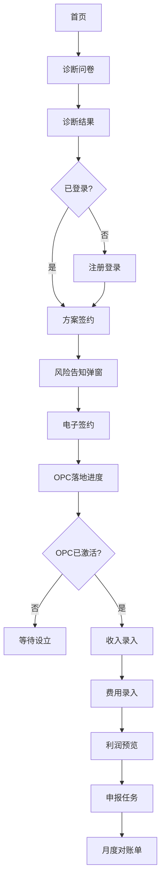

# 主播 OPC 合规服务 —— 信息架构与页面原型说明

> 版本：v1.0  
> 编制时间：2026年6月  
> 依据文档：[主播OPC合规服务-产品文档.md](主播OPC合规服务-产品文档.md)、[主播OPC合规服务-MVP开发Backlog.md](主播OPC合规服务-MVP开发Backlog.md)  
> 说明：本文档为**文字线框 + 组件说明**，供产品、设计与开发对齐；非 Figma 高保真稿。

---

## 一、文档说明

### 1.1 目标读者

- **产品**：确认页面范围与跳转关系  
- **设计**：基于线框出视觉稿  
- **开发**：对照路由与组件拆分任务  

### 1.2 原型粒度

| 层级 | 本文档覆盖 |
|------|-----------|
| 信息架构 | 站点地图、导航规则、权限可见性 |
| 页面清单 | 路径、PRD 编号、角色 |
| 文字线框 | 布局分区、字段、按钮、状态 |
| 交互说明 | 空态/错误态、CTA 跳转 |
| 高保真视觉 | 不在范围，设计阶段补充 |

---

## 二、用户角色与入口

| 角色 | 入口 | 鉴权 | 主要目标 |
|------|------|------|---------|
| **访客** | 门户公开页 `/`、`/diagnosis` | 无 | 了解产品、免费诊断 |
| **主播（会员）** | `/user/*` | middleware + `Xy-User-Token` | 签约、记账、查看对账单 |
| **顾问/运营** | `/admin/compliance/*` | Admin JWT + RBAC | 推进 OPC、处理申报 |

---

## 三、站点地图

### 3.1 总览

```
Portal 公开区                    会员中心 /user/*                 管理后台 /admin/*
├── /                           ├── /user/overview              ├── /admin/compliance/customers
├── /diagnosis                  ├── /user/compliance/*          ├── /admin/compliance/opc-tasks
├── /diagnosis/result           ├── /user/profile               ├── /admin/compliance/filing
├── /pricing                    ├── /user/notification          └── /admin/compliance/statements
├── /legal/privacy              ├── /user/login
├── /legal/terms                └── /user/register
└── /docs/*  (P2)
```

### 3.2 Portal 公开区

| 路径 | 页面名称 | PRD | MVP |
|------|---------|-----|-----|
| `/` | 首页 | — | 是 |
| `/diagnosis` | 合规诊断问卷 | F-01 | 是 |
| `/diagnosis/result` | 诊断结果 | F-02、F-03 | 是 |
| `/pricing` | 服务套餐 | F-09 | 是 |
| `/legal/privacy` | 隐私政策 | F-90 | 是 |
| `/legal/terms` | 用户协议 | F-90 | 是 |
| `/docs` | 政策文档中心 | F-04 | P2（复用现有 CMS） |

### 3.3 会员中心

| 路径 | 页面名称 | PRD | 可见条件 |
|------|---------|-----|---------|
| `/user/overview` | 合规仪表盘 | F-66（简版） | 已登录 |
| `/user/compliance/diagnosis` | 诊断历史 | F-01 | 已登录 |
| `/user/compliance/plan` | 方案确认与签约 | F-09~F-12 | 已登录 |
| `/user/compliance/opc` | OPC 落地进度 | F-16~F-19 | 已签约 |
| `/user/compliance/income` | 收入台账 | F-26~F-30 | OPC active |
| `/user/compliance/expense` | 费用台账 | F-35~F-38 | OPC active |
| `/user/compliance/ledger` | 账套与利润表 | F-44~F-46 | OPC active |
| `/user/compliance/tax` | 申报日历 | F-51~F-55、F-54 | OPC active |
| `/user/compliance/statement` | 月度对账单 | F-61 | OPC active |
| `/user/profile` | 资料与 OPC 绑定 | F-86 | 已登录 |
| `/user/notification` | 通知中心 | F-62、F-65 | 已登录 |
| `/user/login` | 登录 | F-85 | 公开 |
| `/user/register` | 注册 | F-85、F-90 | 公开 |

### 3.4 管理后台

| 路径 | 页面名称 | PRD | MVP |
|------|---------|-----|-----|
| `/admin/compliance/customers` | 合规客户列表 | F-79（简版） | 是 |
| `/admin/compliance/opc-tasks` | OPC 注册任务 | F-17~F-19 | 是 |
| `/admin/compliance/filing` | 申报工作台 | F-51~F-53 | 是 |
| `/admin/compliance/statements` | 对账单管理 | F-61 | 是 |

---

## 四、核心用户流程



### 4.1 月度服务循环


---

## 五、导航与信息架构规则

### 5.1 公开区顶栏

```
[Logo]  首页  |  免费诊断  |  服务价格  |  文档  |  [登录] [注册]
```

- 「免费诊断」→ `/diagnosis`  
- 已登录时「登录」变为「会员中心」→ `/user/overview`

### 5.2 会员中心侧栏

**分组 A：合规服务**（根据状态动态显示）

| 菜单项 | 路径 | 显示条件 |
|--------|------|---------|
| 概览 | `/user/overview` | 始终 |
| 诊断历史 | `/user/compliance/diagnosis` | 始终 |
| 方案与签约 | `/user/compliance/plan` | 无 active 订单 |
| OPC 进度 | `/user/compliance/opc` | 有订单且 OPC 未 active |
| 收入台账 | `/user/compliance/income` | OPC active |
| 费用台账 | `/user/compliance/expense` | OPC active |
| 利润表 | `/user/compliance/ledger` | OPC active |
| 申报日历 | `/user/compliance/tax` | OPC active |
| 月度对账单 | `/user/compliance/statement` | OPC active |

**分组 B：账户**

| 菜单项 | 路径 |
|--------|------|
| 个人资料 | `/user/profile` |
| 通知 | `/user/notification` |
| 修改密码 | `/user/password` |

### 5.3 引导规则

| 用户状态 | 全局引导 |
|---------|---------|
| 未签约 | 顶栏黄色条：「完成方案签约，开启 OPC 合规服务」→ `/user/compliance/plan` |
| OPC 设立中 | 台账/申报菜单置灰；进入时展示进度页引导 |
| 待上传材料 | 概览页红色待办：「请在 X 日前上传 X 月流水」→ 收入/费用页 |
| 申报临近 | 概览倒计时 + 通知推送 |

### 5.4 管理后台菜单

挂于 admin 动态菜单（需配置 `MemberMenu` 或 admin menu 表）：

```
合规服务
  ├── 客户列表
  ├── OPC 任务
  ├── 申报工作台
  └── 对账单
```

---

## 六、页面原型说明（逐页）

> 每页按统一模板：路径 / PRD / 目标 / 布局 / 组件 / 状态 / 跳转 / MVP 差异

---

### P-01 首页

| 属性 | 内容 |
|------|------|
| **路径** | `/` |
| **PRD** | —（获客骨架，P3 F-07 简版） |
| **角色** | 访客 |
| **目标** | 传达合规价值，引导免费诊断 |

**布局**

```
┌─────────────────────────────────────────────┐
│ PortalHeader                                 │
├─────────────────────────────────────────────┤
│ [Hero] 标题 + 副标题（平台报送/金税四期）      │
│        [免费诊断] CTA  [了解服务价格]          │
├─────────────────────────────────────────────┤
│ [三列价值] 合规安全 | 税负优化 | 全程代办       │
├─────────────────────────────────────────────┤
│ [对比条] 劳务 vs OPC 税负示意（静态数字）      │
├─────────────────────────────────────────────┤
│ PortalFooter                                 │
└─────────────────────────────────────────────┘
```

**关键组件**

- Hero CTA 主按钮 → `/diagnosis`  
- 次按钮 → `/pricing`  

**状态**

- 无特殊空态  

**MVP 差异**：无案例轮播、无视频（P3）

---

### P-02 合规诊断问卷

| 属性 | 内容 |
|------|------|
| **路径** | `/diagnosis` |
| **PRD** | F-01 |
| **角色** | 访客 / 主播 |
| **目标** | 10 分钟内完成信息采集 |

**布局**：单页分步表单（Step 1–4）或 Accordion

**Step 1 — 平台与收入**

| 字段 | 类型 | 必填 |
|------|------|------|
| 主要平台 | 多选 Checkbox | 是 |
| 月收入区间 | Select：0-2万 / 2-5万 / 5-15万 / 15万+ | 是 |
| 年可扣除成本（估） | Number 输入 | 否 |

**Step 2 — 现有主体**

| 字段 | 类型 | 必填 |
|------|------|------|
| 是否已有主体 | Radio：无 / 个体户 / 公司 / 其他 | 是 |
| 是否按时报税 | Radio：是 / 否 / 不确定 | 是 |

**Step 3 — 风险信号**

| 字段 | 类型 | 必填 |
|------|------|------|
| 是否被税务局联系过 | Radio：是 / 否 | 是 |
| 补充说明 | Textarea | 否 |

**Step 4 — 成本细项（可选，用于计算器）**

| 字段 | 类型 |
|------|------|
| 设备/投流/场地等 | 快捷金额或跳过 |

**底部**

- `[上一步]` `[下一步]` / 最后一步 `[查看诊断结果]`  

**跳转**

- 提交成功 → `/diagnosis/result?id={diagnosisId}`  

**空态/错误**

- 未选平台：字段下红色提示  
- API 失败：顶部 Alert + 重试  

---

### P-03 诊断结果

| 属性 | 内容 |
|------|------|
| **路径** | `/diagnosis/result` |
| **PRD** | F-02、F-03 |
| **角色** | 访客 / 主播 |
| **目标** | 展示税负对比与推荐方案，驱动签约 |

**布局**

```
┌─────────────────────────────────────────────┐
│ 您的合规诊断结果                               │
├──────────┬──────────┬──────────┬──────────────┤
│ 不报税    │ 纯劳务    │ 个体户    │ OPC ⭐推荐   │
│ ⚠️高危   │ XX万/XX% │ XX万/XX% │ XX万/XX%    │
├──────────┴──────────┴──────────┴──────────────┤
│ [方案摘要卡片] 推荐理由 3 条 bullet              │
│ [税负计算器] 可调年收入/成本 Slider 实时刷新     │
├─────────────────────────────────────────────┤
│ [下载方案摘要 PDF]  [确认方案并签约]             │
└─────────────────────────────────────────────┘
```

**关键组件**

- 四列对比 Card；「不报税」列固定警告样式  
- 推荐 Badge 打在 OPC 或个体户列  
- 计算器：年收入 Input、成本 Input、「重新计算」  
- 免责声明 Footer：「以上为估算，合规≠逃税」  

**跳转**

- 「确认方案并签约」→ 未登录 `/user/login?redirect=/user/compliance/plan`；已登录 → `/user/compliance/plan?diagnosisId=`  
- PDF → 新窗口下载  

**MVP 差异**：无顾问在线咨询入口（P4 F-08）

---

### P-04 服务套餐

| 属性 | 内容 |
|------|------|
| **路径** | `/pricing` |
| **PRD** | F-09 |
| **角色** | 访客 |
| **目标** | 展示三档套餐，引导签约 |

**布局**：三列 Pricing Card

| 套餐 | 月费（示例） | 包含 |
|------|------------|------|
| 基础版 | 299 起 | 注册+记账+季报+汇算 |
| 进阶版 | 799 起 | + 筹划+发票管理 |
| 尊享版 | 面议 | + 架构+稽查应对 |

每卡底部：`[选择此套餐]` → `/user/compliance/plan?plan=basic`

---

### P-05 方案确认与签约

| 属性 | 内容 |
|------|------|
| **路径** | `/user/compliance/plan` |
| **PRD** | F-09、F-10、F-11、F-12 |
| **角色** | 主播 |
| **目标** | 完成风险告知、方案确认、电子签约 |

**布局**

```
┌─────────────────────────────────────────────┐
│ Step 1 选择套餐    Step 2 风险告知    Step 3 签约 │
├─────────────────────────────────────────────┤
│ [当前 Step 内容区]                             │
└─────────────────────────────────────────────┘
```

**Step 2 — 风险告知（F-12）模态/内嵌**

- 4 条 Checkbox，全文可见不可折叠：  
  1. 本服务为合规方案，非逃税方案  
  2. 不承诺「包不被查」  
  3. 不提供虚开发票、隐瞒收入服务  
  4. 税负取决于真实成本与收入  
- 全部勾选才能「下一步」  

**Step 3 — 签约（F-10、F-11）**

| 组件 | 说明 |
|------|------|
| 方案摘要 | 只读，来自 diagnosisId |
| 服务协议 | PDF 嵌入预览 + 滚动到底检测 |
| 确认勾选 | 「我已阅读并同意服务协议」 |
| 电子签名 | 输入姓名确认（MVP） |
| 提交 | `[完成签约]` |

**跳转**

- 成功 → `/user/compliance/opc`  

**MVP 差异**：无腾讯电子签 API（P2）；MVP 姓名确认 + PDF 存档

---

### P-06 OPC 落地进度

| 属性 | 内容 |
|------|------|
| **路径** | `/user/compliance/opc` |
| **PRD** | F-16~F-19 |
| **角色** | 主播 |
| **目标** | 提交资料、跟踪设立进度 |

**布局**

```
┌─────────────────────────────────────────────┐
│ OPC 设立进度                    预计 14 工作日 │
├─────────────────────────────────────────────┤
│ ● 资料提交  ○ 工商注册  ○ 税务登记  ○ 银行开户 │
│   [垂直时间轴，当前步高亮]                      │
├─────────────────────────────────────────────┤
│ [资料表单 / 或已完成只读展示]                   │
│ 身份证上传 | 经营范围 | 注册地址 | 邮箱        │
├─────────────────────────────────────────────┤
│ [银行开户指引]  collapsible 材料清单            │
│ [上传开户回执]                                 │
└─────────────────────────────────────────────┘
```

**时间轴状态**

| 节点 | 子状态 |
|------|--------|
| 资料提交 | 待提交 / 审核中 / 已通过 |
| 工商注册 | 进行中 / 执照已下发 |
| 税务登记 | 进行中 / 已完成 |
| 银行开户 | 待开户 / 已完成 |

**跳转**

- 全部完成 → 概览 Toast + 侧栏解锁台账菜单  

---

### P-07 合规仪表盘（会员概览）

| 属性 | 内容 |
|------|------|
| **路径** | `/user/overview` |
| **PRD** | F-66（简版）、F-54、F-65 |
| **角色** | 主播 |
| **目标** | 一屏掌握 OPC 状态与本月待办 |

**布局**

```
┌────────────┬────────────┬────────────┐
│ OPC 状态    │ 本月收入    │ 本月利润    │
│ 已激活/设立中│ ¥ XX       │ ¥ XX       │
├────────────┴────────────┴────────────┤
│ [待办列表]                             │
│ · 上传 5 月银行流水（截止 6/5）          │
│ · 增值税申报（截止 6/15）               │
├────────────────────────────────────────┤
│ [快捷入口] 记收入 | 记费用 | 看对账单    │
└────────────────────────────────────────┘
```

**未签约空态**

- 插画 + 「开始免费诊断」→ `/diagnosis`  

---

### P-08 收入台账

| 属性 | 内容 |
|------|------|
| **路径** | `/user/compliance/income` |
| **PRD** | F-26~F-30 |
| **角色** | 主播 |
| **目标** | 录入/导入多平台收入 |

**布局**

```
┌─────────────────────────────────────────────┐
│ 月份选择 [2026-06 ▼]    [+ 记一笔] [导入 CSV] │
├─────────────────────────────────────────────┤
│ Tab: 全部 | 抖音 | 快手 | B站 | 视频号 | 小红书 │
├─────────────────────────────────────────────┤
│ 表格                                           │
│ 日期 | 类型 | 含税收入 | 平台费 | 实收 | 操作    │
├─────────────────────────────────────────────┤
│ 本月合计：含税 XX | 实收 XX                     │
│ [银行流水对账] 未匹配 3 笔 → 展开               │
└─────────────────────────────────────────────┘
```

**记一笔 Modal 字段**

| 字段 | 类型 |
|------|------|
| 日期 | Date |
| 平台 | Select |
| 收入类型 | Select（F-27） |
| 含税收入 | Number |
| 平台服务费 | Number（自动算实收） |

**导入 CSV Modal**

- 下载模板链接  
- 文件 Upload  
- 预览表格 + 确认导入  

**OPC 未激活占位**

- 全页 Mask：「OPC 设立完成后开放」→ `/user/compliance/opc`  

---

### P-09 费用台账

| 属性 | 内容 |
|------|------|
| **路径** | `/user/compliance/expense` |
| **PRD** | F-35~F-38 |
| **角色** | 主播 |
| **目标** | 录入成本并上传凭证 |

**布局**：与 P-08 类似，无平台 Tab

**记一笔 Modal**

| 字段 | 类型 |
|------|------|
| 日期 | Date |
| 费用类型 | Select（F-37 库，选中显示凭证说明 Tooltip） |
| 金额 | Number |
| 发票类型 | 普票/专票/无票 |
| 凭证上传 | File（F-36） |

**拦截警告条（F-38）**

- 成本/收入比 &gt; 80%：黄色 Banner + 确认 Checkbox  
- 黑名单关键词：红色 Banner，禁止提交  

---

### P-10 账套与利润表

| 属性 | 内容 |
|------|------|
| **路径** | `/user/compliance/ledger` |
| **PRD** | F-44~F-46 |
| **角色** | 主播 |
| **目标** | 查看自动生成的利润与账套摘要 |

**布局**

```
┌─────────────────────────────────────────────┐
│ [月 | 季 | 年] 周期切换                        │
├─────────────────────────────────────────────┤
│ 利润表（简版）                                 │
│ 营业收入（不含税）    ¥ XXX                    │
│ 营业成本              ¥ XXX                    │
│ ─────────────────────────                     │
│ 利润总额              ¥ XXX                    │
│ 累计年度利润          ¥ XXX                    │
├─────────────────────────────────────────────┤
│ [可选展开] 本月会计分录列表（只读）              │
│ 日期 | 摘要 | 借方 | 贷方 | 金额               │
└─────────────────────────────────────────────┘
```

**MVP 差异**：无资产负债表（F-47 P2）

---

### P-11 申报日历

| 属性 | 内容 |
|------|------|
| **路径** | `/user/compliance/tax` |
| **PRD** | F-51~F-55、F-54、F-69 |
| **角色** | 主播 |
| **目标** | 查看申报截止日与任务状态 |

**布局**

```
┌─────────────────────────────────────────────┐
│ ◀ 2026年6月 ▶          下次截止：6月15日(7天) │
├─────────────────────────────────────────────┤
│ [月历格子，截止日标记红点]                      │
├─────────────────────────────────────────────┤
│ 本月任务列表                                   │
│ · 增值税（小规模）  待申报  预估 ¥0  [详情]     │
│ · 企税季度预缴      已申报  ¥XXX   [回执]      │
├─────────────────────────────────────────────┤
│ [报税前自查清单] 9 项 Checkbox（只读/顾问勾选） │
└─────────────────────────────────────────────┘
```

**任务详情 Drawer**

- 计算明细：不含税收入、增值税、附加税、企税  
- 状态：pending / filed / overdue  
- 回执 PDF 下载（已申报时）  

---

### P-12 月度对账单

| 属性 | 内容 |
|------|------|
| **路径** | `/user/compliance/statement` |
| **PRD** | F-61、F-62 |
| **角色** | 主播 |
| **目标** | 查看历史对账单与服务完成状态 |

**布局**

```
┌─────────────────────────────────────────────┐
│ 对账单列表                                     │
│ 月份 | 收入 | 成本 | 利润 | 预缴税额 | 状态 | 操作 │
│ 2026-05 | ... | ... | ... | ... | ✅已完成 | [PDF] │
├─────────────────────────────────────────────┤
│ [选中月份详情卡片]                              │
│ 与微信模板一致的服务完成摘要                     │
└─────────────────────────────────────────────┘
```

**PDF 内容结构**（与实操手册 5.2 模板对齐）

- 本月收入 / 成本 / 利润  
- 本月预缴税额  
- 累计年度利润  
- 申报状态：已申报完成  

---

### P-13 个人资料与 OPC 绑定

| 属性 | 内容 |
|------|------|
| **路径** | `/user/profile` |
| **PRD** | F-86、F-89 |
| **角色** | 主播 |
| **目标** | 展示会员信息与绑定的 OPC 主体 |

**布局**：在现有 profile 页增加「合规主体」Card

| 字段 | 展示 |
|------|------|
| OPC 名称 | 文本 |
| 统一社会信用代码 | 文本 |
| 状态 | Tag：设立中 / 已激活 |
| 对公账户 | 脱敏尾号 |

---

### P-14 隐私政策 / 用户协议

| 属性 | 内容 |
|------|------|
| **路径** | `/legal/privacy`、`/legal/terms` |
| **PRD** | F-90 |
| **角色** | 访客 |
| **目标** | 法律文本展示，注册页链接引用 |

**布局**：Markdown 渲染长文 + 版本号 + 更新日期

---

### P-15 管理端 — OPC 任务队列

| 属性 | 内容 |
|------|------|
| **路径** | `/admin/compliance/opc-tasks` |
| **PRD** | F-17~F-19 |
| **角色** | 顾问 |
| **目标** | 批量处理 OPC 注册进度 |

**布局**

```
┌─────────────────────────────────────────────┐
│ 筛选：状态 | 搜索主播名                        │
├─────────────────────────────────────────────┤
│ 表格                                           │
│ 主播 | 公司名 | 当前节点 | 提交日 | SLA | 操作   │
├─────────────────────────────────────────────┤
│ [行操作] 更新进度 Modal：节点下拉 + 备注 + 附件  │
└─────────────────────────────────────────────┘
```

---

### P-16 管理端 — 申报工作台

| 属性 | 内容 |
|------|------|
| **路径** | `/admin/compliance/filing` |
| **PRD** | F-51~F-53、F-69 |
| **角色** | 顾问 |
| **目标** | 批量申报确认与回执上传 |

**布局**

```
┌─────────────────────────────────────────────┐
│ 筛选：税种 | 截止月 | 状态                      │
├─────────────────────────────────────────────┤
│ 表格                                           │
│ 主播 | OPC | 税种 | 周期 | 预估税额 | 状态 | 操作 │
├─────────────────────────────────────────────┤
│ [标记已申报] → 强制完成 9 项自查 → 上传回执 PDF  │
└─────────────────────────────────────────────┘
```

---

### P-17 管理端 — 对账单管理

| 属性 | 内容 |
|------|------|
| **路径** | `/admin/compliance/statements` |
| **PRD** | F-61 |
| **角色** | 顾问 |
| **目标** | 生成并发送月度对账单 |

**操作**

- `[批量生成]` 选中月份  
- `[发送通知]` 触发 MemberNotice  
- 预览 PDF  

---

## 七、P1 功能与页面对照矩阵

| PRD | 功能 | 主要页面 |
|-----|------|---------|
| F-01 | 合规诊断问卷 | P-02, P-07（历史） |
| F-02 | 税负计算器 | P-03 |
| F-03 | 方案推荐 | P-03 |
| F-09 | 服务套餐 | P-04, P-05 |
| F-10 | 电子签约 | P-05 |
| F-11 | 方案确认 | P-05 |
| F-12 | 风险告知 | P-05 |
| F-16 | 注册资料 | P-06 |
| F-17 | 工商注册 | P-06, P-15 |
| F-18 | 税务登记 | P-06, P-15 |
| F-19 | 银行开户 | P-06, P-15 |
| F-26 | 收入台账 | P-08 |
| F-27 | 收入分类 | P-08 |
| F-28 | 流水导入 | P-08 |
| F-29 | 平台服务费 | P-08 |
| F-30 | 银行对账 | P-08 |
| F-35 | 费用台账 | P-09 |
| F-36 | 凭证上传 | P-09 |
| F-37 | 费用类型库 | P-09 |
| F-38 | 虚增拦截 | P-09 |
| F-44 | 标准账套 | P-10 |
| F-45 | 自动分录 | P-10 |
| F-46 | 利润表 | P-10 |
| F-51 | 增值税 | P-11, P-16 |
| F-52 | 企税预缴 | P-11, P-16 |
| F-53 | 企税汇算 | P-11, P-16 |
| F-54 | 申报日历 | P-07, P-11 |
| F-55 | 附加税费 | P-11 |
| F-61 | 月度对账单 | P-12, P-17 |
| F-62 | 服务完成通知 | P-12（+ 通知） |
| F-65 | 材料催收 | P-07（待办） |
| F-68 | 合规规则引擎 | P-08, P-09, P-16 |
| F-69 | 自查清单 | P-11, P-16 |
| F-74 | 操作留痕 | 全站（后台审计） |
| F-85 | 注册登录 | P-13, login/register |
| F-86 | OPC 绑定 | P-06, P-13 |
| F-89 | 数据安全 | 全站（脱敏展示） |
| F-90 | 隐私/协议 | P-14, register |

**覆盖率：32/32 P1 均已映射到页面。**

---

## 八、与现有代码的映射

| 页面/能力 | 实现路径 | 说明 |
|----------|---------|------|
| 首页改造 | `app/(portal)/page.tsx` | 增加合规 CTA |
| 诊断页 | `app/(portal)/diagnosis/page.tsx`（新建） | |
| 诊断结果 | `app/(portal)/diagnosis/result/page.tsx`（新建） | |
| 套餐页 | `app/(portal)/pricing/page.tsx`（新建） | |
| 法律页 | `app/(portal)/legal/privacy/page.tsx` 等（新建） | |
| 会员合规视图 | `components/portal/member/compliance/*.tsx`（新建） | |
| 注册表扩展 | `lib/portal/member-registry.tsx` | 添加 `/user/compliance/*` |
| 管理合规视图 | `components/admin/views/compliance-*.tsx`（新建） | |
| Admin 注册表 | `lib/admin/registry.tsx` | 添加 compliance 路由 |
| 合规 API | `app/member/compliance/**/route.ts`（新建） | memberRoute |
| 公开 API | `app/site/compliance/**/route.ts`（新建） | 无需登录 |
| 管理 API | `app/admin/compliance/**/route.ts`（新建） | adminRoute |
| 业务逻辑 | `lib/services/compliance/*.ts`（新建） | |
| 通知复用 | `MemberNotice` + 现有 notice API | 催收、完成通知 |
| 附件复用 | `SysAttachment` + upload | 身份证、发票、回执 |
| 定时任务 | `lib/cron/tasks.ts` | 催收、对账单生成 |

### 8.1 member-registry 扩展示例

```typescript
// lib/portal/member-registry.tsx 新增条目
'/user/compliance/diagnosis': ComplianceDiagnosisView,
'/user/compliance/plan': CompliancePlanView,
'/user/compliance/opc': ComplianceOpcView,
'/user/compliance/income': ComplianceIncomeView,
'/user/compliance/expense': ComplianceExpenseView,
'/user/compliance/ledger': ComplianceLedgerView,
'/user/compliance/tax': ComplianceTaxView,
'/user/compliance/statement': ComplianceStatementView,
```

---

## 九、响应式与无障碍

| 要点 | 说明 |
|------|------|
| 移动优先 | 主播主要用手机；表格改卡片列表；侧栏改底部 Tab 或 Drawer |
| 表单 | 所有 Input 关联 `<Label>`；错误 `aria-describedby` |
| 合规文案 | 风险告知、免责声明完整展示，不可折叠隐藏 |
| 触控 | 主 CTA 最小 44×44px 点击区域 |
| 色彩 | 警告/危险不单靠颜色，需图标 + 文字 |

---

## 十、页面统计

| 类别 | 数量 |
|------|------|
| Portal 公开页 | 7 |
| 会员中心页 | 12（含 login/register） |
| 管理后台页 | 4 |
| **详述线框页** | **17（P-01~P-17）** |

---

*本文档与 [MVP Backlog](主播OPC合规服务-MVP开发Backlog.md) 同步维护；页面路径变更时需双向更新。*
